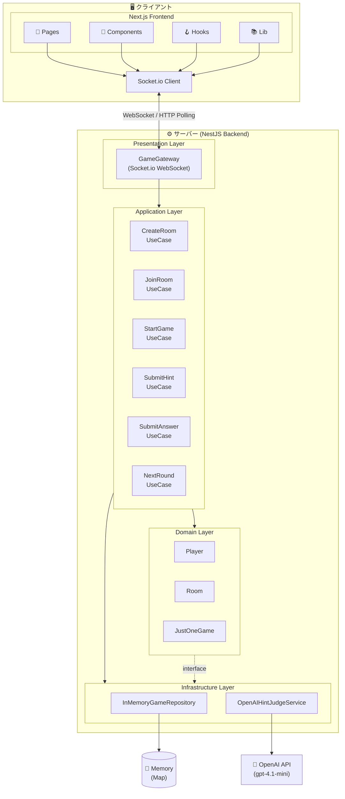
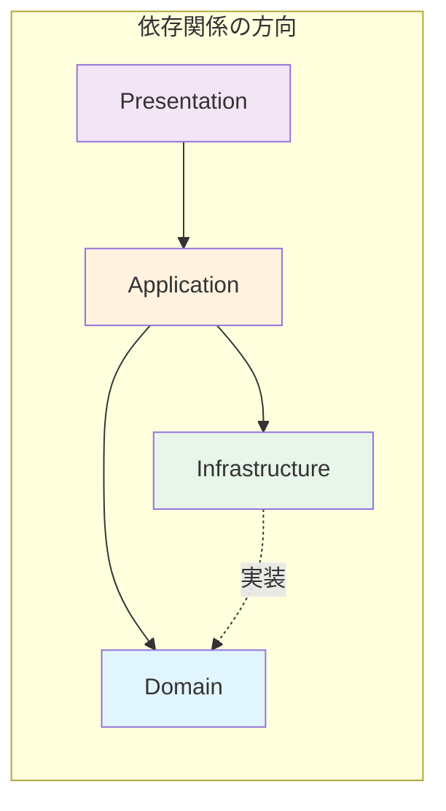
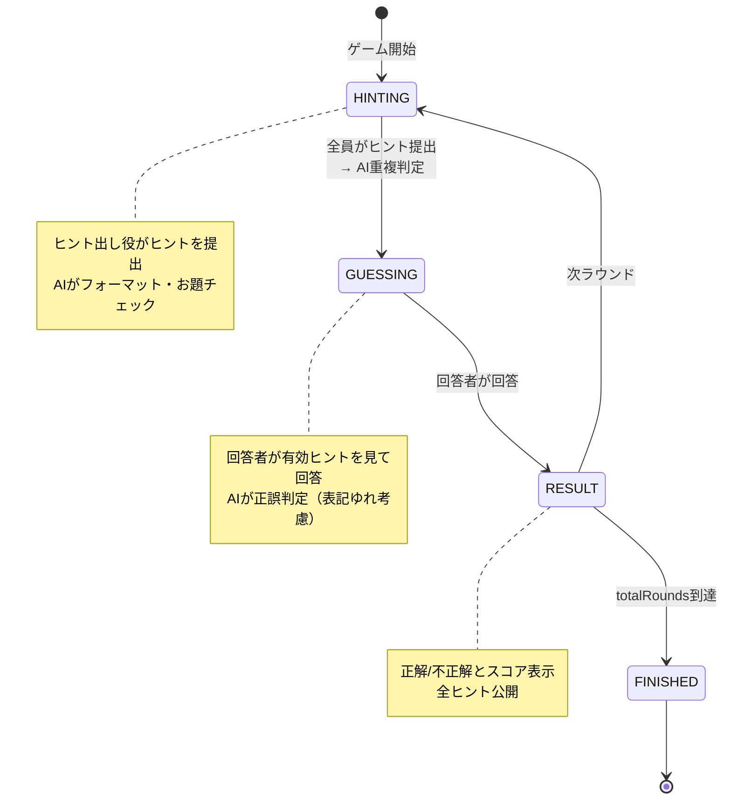
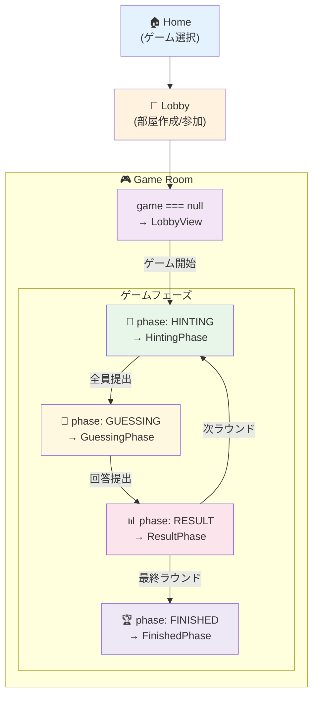
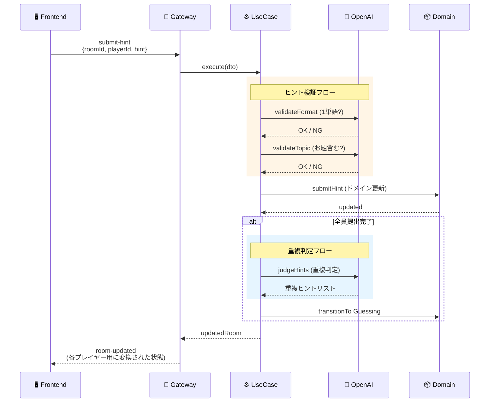
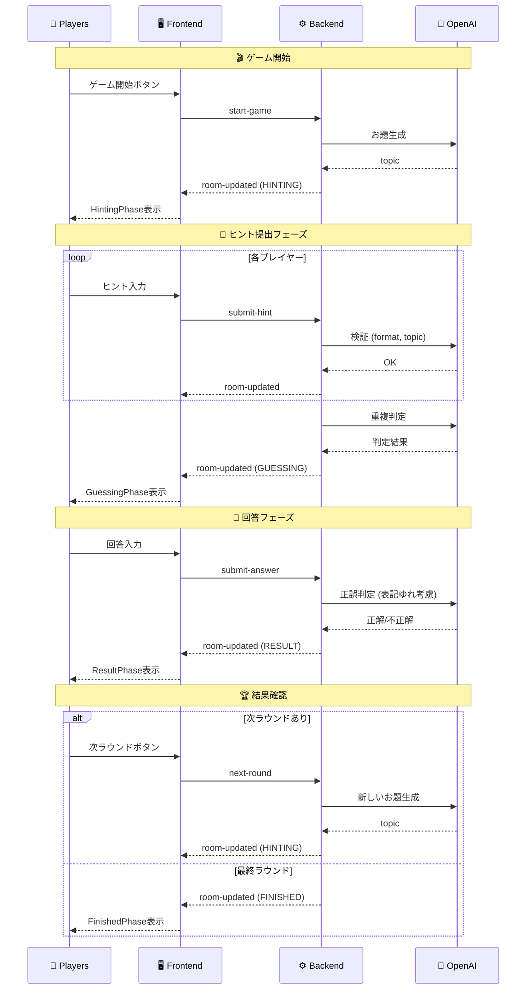

# アーキテクチャ設計

## 概要

Party Box は Clean Architecture パターンを採用したリアルタイム・マルチプレイヤー・ゲームプラットフォームです。

## システム構成図



### レイヤー間の依存関係



## バックエンド: Clean Architecture

### 4 層構造

```
backend/src/
├── domain/           # ドメイン層: ビジネスロジック（純粋な TypeScript）
├── application/      # アプリケーション層: ユースケース
├── infrastructure/   # インフラ層: 外部サービス実装
└── presentation/     # プレゼンテーション層: WebSocket Gateway
```

### 1. ドメイン層 (`domain/`)

フレームワーク非依存の純粋なビジネスロジック。

```
domain/
├── model/
│   ├── player.ts              # Player エンティティ
│   ├── room.ts                # Room エンティティ
│   ├── game-base.ts           # ゲーム共通定義
│   └── games/
│       ├── index.ts           # ゲーム型 export
│       └── just-one/
│           └── just-one.game.ts  # JustOne ゲームロジック
├── repository/
│   └── i-game.repository.ts   # リポジトリインターフェース
└── service/
    └── i-hint-judge.service.ts # AI 判定サービスインターフェース
```

**主要モデル:**

| モデル        | 責務                                             |
| ------------- | ------------------------------------------------ |
| `Player`      | プレイヤー情報（ID、名前、ホスト判定、接続状態） |
| `Room`        | 部屋管理（プレイヤー一覧、ゲーム状態）           |
| `JustOneGame` | ゲーム状態（フェーズ、お題、ヒント、ラウンド）   |

**ゲームフェーズ遷移:**



### 2. アプリケーション層 (`application/`)

ユースケースがドメインロジックを調整。

```
application/
├── usecase/
│   ├── helpers/
│   │   └── game-validation.helper.ts  # 共通検証ロジック
│   ├── create-room.usecase.ts
│   ├── join-room.usecase.ts
│   ├── start-game.usecase.ts
│   ├── submit-hint.usecase.ts
│   ├── submit-answer.usecase.ts
│   ├── next-round.usecase.ts
│   └── regenerate-topic.usecase.ts
├── dto/
│   └── game-action.dto.ts        # 入力 DTO
└── error/
    └── game.errors.ts            # カスタムエラー
```

**ユースケース一覧:**

| ユースケース             | 責務                              |
| ------------------------ | --------------------------------- |
| `CreateRoomUseCase`      | 新規部屋作成、ホスト設定          |
| `JoinRoomUseCase`        | 部屋参加、プレイヤー追加          |
| `StartGameUseCase`       | ゲーム開始、お題生成、回答者決定  |
| `SubmitHintUseCase`      | ヒント提出、AI 検証、フェーズ遷移 |
| `SubmitAnswerUseCase`    | 回答提出、正誤判定                |
| `NextRoundUseCase`       | 次ラウンド開始 or ゲーム終了      |
| `RegenerateTopicUseCase` | お題再生成（ホストのみ）          |

### 3. インフラ層 (`infrastructure/`)

外部依存の実装。

```
infrastructure/
├── repository/
│   └── in-memory-game.repository.ts  # メモリ内データ保存
├── service/
│   ├── openai-hint-judge.service.ts  # OpenAI API 連携
│   └── prompts/
│       └── just-one.prompts.ts       # AI プロンプト定数
└── module/
    ├── app.module.ts                 # ルートモジュール
    └── game.module.ts                # ゲームモジュール（DI 設定）
```

**リポジトリ:**

```typescript
// インターフェース（domain層）
interface IGameRepository {
  saveRoom(room: Room): Promise<void>;
  findRoomById(roomId: string): Promise<Room | null>;
  deleteRoom(roomId: string): Promise<void>;
  roomExists(roomId: string): Promise<boolean>;
}

// 実装（infrastructure層）- MVP 用インメモリ
class InMemoryGameRepository implements IGameRepository {
  private rooms = new Map<string, Room>();
  // ...
}
```

**AI サービス:**

```typescript
// インターフェース（domain層）
interface IHintJudgeService {
  generateTopic(excludeTopics?: string[]): Promise<string>;
  validateHintFormat(hint: string): Promise<HintFormatValidation>;
  validateHintAgainstTopic(
    topic: string,
    hint: string,
  ): Promise<HintFormatValidation>;
  judgeHints(topic: string, hints: Hint[]): Promise<HintJudgmentResult[]>;
  judgeAnswer(topic: string, answer: string): Promise<AnswerJudgment>;
}

// 実装（infrastructure層）- OpenAI GPT-4o-mini
class OpenAIHintJudgeService implements IHintJudgeService {
  // gpt-4.1-mini を使用（低コスト・高速）
}
```

### 4. プレゼンテーション層 (`presentation/`)

Socket.io WebSocket Gateway。

```
presentation/
└── gateway/
    └── game.gateway.ts   # WebSocket イベントハンドラ
```

**責務:**

- クライアント接続/切断管理
- イベントを適切なユースケースにルーティング
- ルーム状態のブロードキャスト
- プレイヤーごとのビュー変換（回答者にお題を隠すなど）

---

## フロントエンド: Next.js App Router

### ディレクトリ構成

```
frontend/src/
├── app/                        # App Router
│   ├── layout.tsx              # ルートレイアウト
│   ├── page.tsx                # ホーム（ゲーム選択）
│   ├── globals.css             # グローバルスタイル
│   └── just-one/
│       ├── page.tsx            # ロビー（部屋作成/参加）
│       ├── room/[roomId]/
│       │   └── page.tsx        # ゲームルーム
│       └── dev/
│           └── page.tsx        # 開発用マルチプレイヤーテスト
├── components/
│   ├── common/                 # 共通コンポーネント
│   ├── lobby/                  # ロビー画面
│   └── game/                   # ゲームフェーズ別
│       ├── HintingPhase.tsx
│       ├── GuessingPhase.tsx
│       ├── ResultPhase.tsx
│       └── FinishedPhase.tsx
├── hooks/
│   └── useSocket.ts            # Socket.io 管理フック
├── lib/
│   ├── socket.ts               # Socket.io クライアント
│   ├── storage.ts              # localStorage ユーティリティ
│   └── game-helpers.ts         # ゲームヘルパー関数
└── types/
    └── game.ts                 # 型定義（バックエンドと共通）
```

### 画面遷移図



### 状態管理

**useSocket フック:**

```typescript
const {
  isConnected, // WebSocket 接続状態
  roomState, // サーバーから受信したルーム状態
  error, // エラーメッセージ
  createRoom, // 部屋作成
  joinRoom, // 部屋参加
  startGame, // ゲーム開始
  submitHint, // ヒント提出
  submitAnswer, // 回答提出
  nextRound, // 次ラウンド
  regenerateTopic, // お題再生成
  clearError, // エラークリア
} = useSocket();
```

**ローカルストレージ:**

```typescript
// プレイヤー識別
PLAYER_ID_KEY   // UUID（自動生成）
PLAYER_NAME_KEY // 入力した名前

// Dev モード用（別キー）
PLAYER_ID_KEY_dev1, PLAYER_NAME_KEY_dev1 など
```

---

## データフロー

### ヒント提出の例



### ゲーム開始〜終了の全体フロー



---

## AI 連携

### OpenAI 使用箇所

| 機能             | 用途                         | モデル       |
| ---------------- | ---------------------------- | ------------ |
| お題生成         | ランダムカテゴリから単語生成 | gpt-4.1-mini |
| フォーマット検証 | 1 単語かどうか判定           | gpt-4.1-mini |
| お題チェック     | お題と関連しすぎないか       | gpt-4.1-mini |
| 重複判定         | ヒント同士の重複検出         | gpt-4.1-mini |
| 回答判定         | 表記ゆれを考慮した正誤判定   | gpt-4.1-mini |

### プロンプト管理

`backend/src/infrastructure/service/prompts/just-one.prompts.ts`:

```typescript
export const SYSTEM_PROMPTS = {
  GENERATE_TOPIC: "日本語の名詞を1つだけ出力...",
  VALIDATE_FORMAT: "1単語チェッカー...",
  // ...
};

export const USER_PROMPTS = {
  generateTopic: (category, randomNum, excludeTopics) => `...`,
  validateFormat: (hint) => `...`,
  // ...
};
```

---

## 拡張性

### 新しいゲームを追加する場合

1. **ドメイン層**: `domain/model/games/new-game/` にゲームモデル追加
2. **アプリケーション層**: 必要なユースケース追加
3. **インフラ層**: AI サービスの拡張（必要に応じて）
4. **プレゼンテーション層**: Gateway にイベントハンドラ追加
5. **フロントエンド**: ゲーム専用コンポーネント追加

### データベース移行

`IGameRepository` インターフェースを実装する新しいリポジトリを作成:

```typescript
// PostgreSQL の例
class PostgresGameRepository implements IGameRepository {
  constructor(private prisma: PrismaClient) {}

  async saveRoom(room: Room): Promise<void> {
    await this.prisma.room.upsert({...});
  }
  // ...
}
```

DI 設定を変更するだけで移行完了。

---

## 技術的決定

| 決定                 | 理由                                 |
| -------------------- | ------------------------------------ |
| Clean Architecture   | テスト容易性、フレームワーク非依存   |
| インメモリストレージ | MVP の迅速な開発、DB 設定不要        |
| Socket.io            | WebSocket + ポーリングフォールバック |
| OpenAI GPT-4o-mini   | 低コスト、高速、十分な精度           |
| Next.js App Router   | 最新の React パターン、SSR 対応      |
| Tailwind CSS         | 高速な UI 開発、一貫性               |
