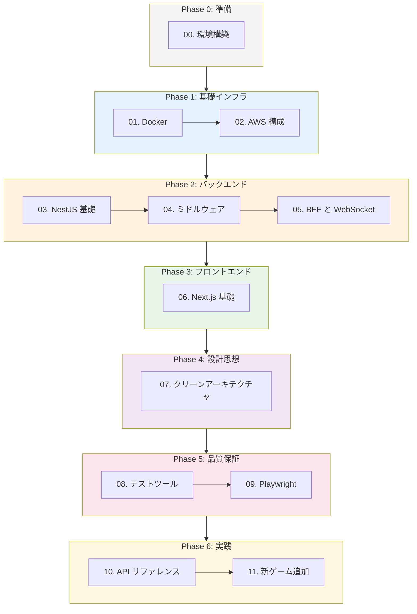

# Party Box 学習ロードマップ

Party Box プロジェクトを通じて学ぶ、実践的な Web エンジニアリングカリキュラム。

---

## このプロジェクトで学べること

```
┌─────────────────────────────────────────────────────────────────┐
│                     Party Box で学べる技術                      │
├─────────────────────────────────────────────────────────────────┤
│  インフラ        │  Docker, AWS (ECS/ECR/RDS), CI/CD           │
├─────────────────────────────────────────────────────────────────┤
│  バックエンド    │  NestJS, TypeScript, WebSocket, DI          │
├─────────────────────────────────────────────────────────────────┤
│  フロントエンド  │  Next.js (App Router), React, Tailwind CSS  │
├─────────────────────────────────────────────────────────────────┤
│  設計思想        │  クリーンアーキテクチャ, DDD, SOLID         │
├─────────────────────────────────────────────────────────────────┤
│  品質保証        │  Jest, React Testing Library, Playwright    │
├─────────────────────────────────────────────────────────────────┤
│  リアルタイム    │  Socket.io, WebSocket, BFF パターン         │
├─────────────────────────────────────────────────────────────────┤
│  AI 連携         │  OpenAI API, プロンプトエンジニアリング     │
└─────────────────────────────────────────────────────────────────┘
```

---

## 学習ロードマップ



---

## カリキュラム一覧

| # | トピック | ファイル | 習得スキル |
|---|----------|----------|-----------|
| 00 | 環境構築 | [00-setup.md](./curriculum/00-setup.md) | 開発環境, Docker Compose |
| 01 | Docker の仕組み | [01-docker.md](./curriculum/01-docker.md) | コンテナ, イメージ, Dockerfile |
| 02 | AWS 構成 | [02-aws.md](./curriculum/02-aws.md) | ECS, ECR, RDS, ALB, VPC |
| 03 | NestJS 基礎 | [03-nestjs.md](./curriculum/03-nestjs.md) | Module, DI, Provider, Gateway |
| 04 | ミドルウェア | [04-middleware.md](./curriculum/04-middleware.md) | Guards, Pipes, Interceptors |
| 05 | BFF と WebSocket | [05-bff-websocket.md](./curriculum/05-bff-websocket.md) | Socket.io, リアルタイム通信 |
| 06 | Next.js 基礎 | [06-nextjs.md](./curriculum/06-nextjs.md) | App Router, RSC, SSR |
| 07 | クリーンアーキテクチャ | [07-clean-architecture.md](./curriculum/07-clean-architecture.md) | 4層構造, DIP, 依存性逆転 |
| 08 | テストツール | [08-testing.md](./curriculum/08-testing.md) | Jest, Testing Library, モック |
| 09 | Playwright (E2E) | [09-playwright.md](./curriculum/09-playwright.md) | E2E テスト, Page Object |
| 10 | API リファレンス | [10-api-reference.md](./curriculum/10-api-reference.md) | WebSocket イベント, 型定義 |
| 11 | 実践: 新ゲーム追加 | [11-practical.md](./curriculum/11-practical.md) | 総合演習, 設計から実装まで |

---

## 推奨学習順序

### 最短ルート（コア概念のみ）

```
00 → 03 → 05 → 06 → 07
環境  NestJS  WebSocket  Next.js  設計
```

### フルコース

```
00 → 01 → 02 → 03 → 04 → 05 → 06 → 07 → 08 → 09 → 10 → 11
```

### 目的別ルート

**バックエンド強化:**
```
00 → 01 → 03 → 04 → 05 → 07 → 08
```

**フロントエンド強化:**
```
00 → 06 → 05 → 09
```

**インフラ強化:**
```
00 → 01 → 02
```

**設計力強化:**
```
07 → 11
```

---

## 各ドキュメントの構成

すべてのカリキュラムは以下の構成で統一:

1. **概要** - そのトピックが何か、なぜ重要か
2. **コア概念** - 押さえるべき重要な概念
3. **Party Box での実装例** - プロジェクト内の実際のコード
4. **ハンズオン課題** - 理解を深めるための実践課題
5. **参考リソース** - 公式ドキュメントや推奨記事
6. **チェックリスト** - 理解度の自己確認

---

## 技術スタック

### Frontend

```
Next.js 15 (App Router)
├── React 19
├── TypeScript
├── Tailwind CSS
└── Socket.io Client
```

### Backend

```
NestJS 11
├── TypeScript
├── Socket.io
├── OpenAI API
└── Clean Architecture (4層構造)
```

### Infrastructure

```
Docker / Docker Compose
├── Node.js 20 Alpine
└── (将来) AWS ECS/ECR/RDS
```

### Testing

```
Jest
├── NestJS Testing
├── React Testing Library
└── Playwright (E2E)
```

---

## 関連ドキュメント

| ドキュメント | 内容 |
|-------------|------|
| [ARCHITECTURE.md](./ARCHITECTURE.md) | システム設計、データフロー、図解 |
| [../README.md](../README.md) | プロジェクト概要、クイックスタート |

---

## 進捗管理

学習の進捗を管理するためのチェックリスト:

### Phase 0: 準備
- [ ] Node.js 20+ をインストール
- [ ] Docker をインストール
- [ ] OpenAI API キーを取得
- [ ] プロジェクトを起動できた

### Phase 1: 基礎インフラ
- [ ] Docker イメージとコンテナの違いを説明できる
- [ ] Dockerfile を読み書きできる
- [ ] AWS の主要サービスを理解している

### Phase 2: バックエンド
- [ ] NestJS の Module/Provider/Controller を理解している
- [ ] DI（依存性注入）のメリットを説明できる
- [ ] WebSocket Gateway を実装できる
- [ ] ミドルウェアの種類と使い分けを理解している

### Phase 3: フロントエンド
- [ ] App Router のルーティングを理解している
- [ ] Server Components と Client Components の違いを説明できる
- [ ] Socket.io クライアントを使った実装ができる

### Phase 4: 設計思想
- [ ] クリーンアーキテクチャの4層構造を説明できる
- [ ] 依存性逆転の原則を説明できる
- [ ] テストしやすい設計のメリットを理解している

### Phase 5: 品質保証
- [ ] Jest でユニットテストを書ける
- [ ] React Testing Library でコンポーネントをテストできる
- [ ] Playwright で E2E テストを書ける

### Phase 6: 実践
- [ ] WebSocket API の設計を理解している
- [ ] 新しいゲームを追加する手順を理解している
- [ ] 実際に新機能を追加してみた

---

## 学習のコツ

1. **手を動かす** - 読むだけでなく、実際にコードを書く
2. **小さく始める** - まず動くものを作り、徐々に改善
3. **エラーを恐れない** - エラーメッセージは学習の機会
4. **コードを読む** - Party Box の実装を参考にする
5. **質問する** - 分からないことは調べる、聞く

---

## 次のステップ

まずは [00-setup.md](./curriculum/00-setup.md) で環境構築を完了させよう。
