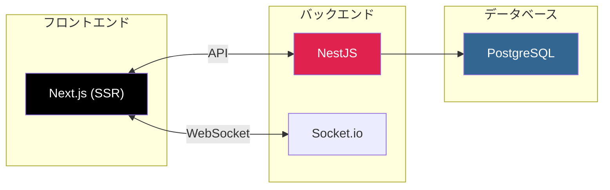
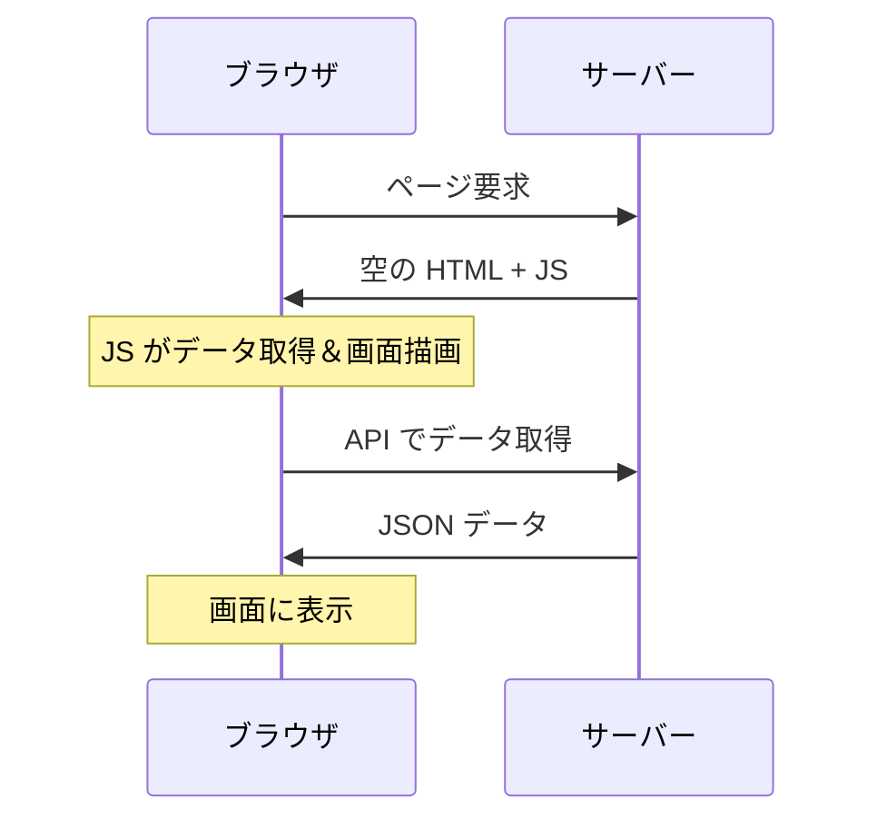
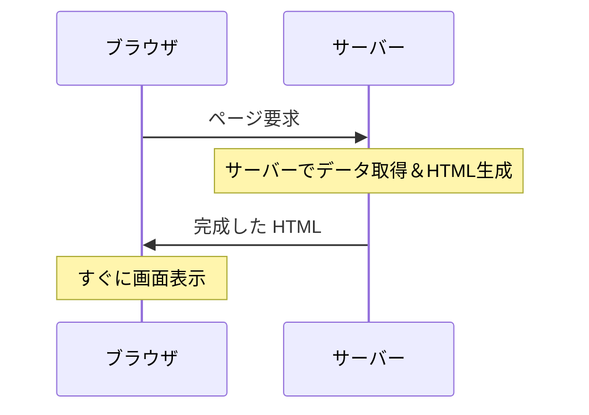
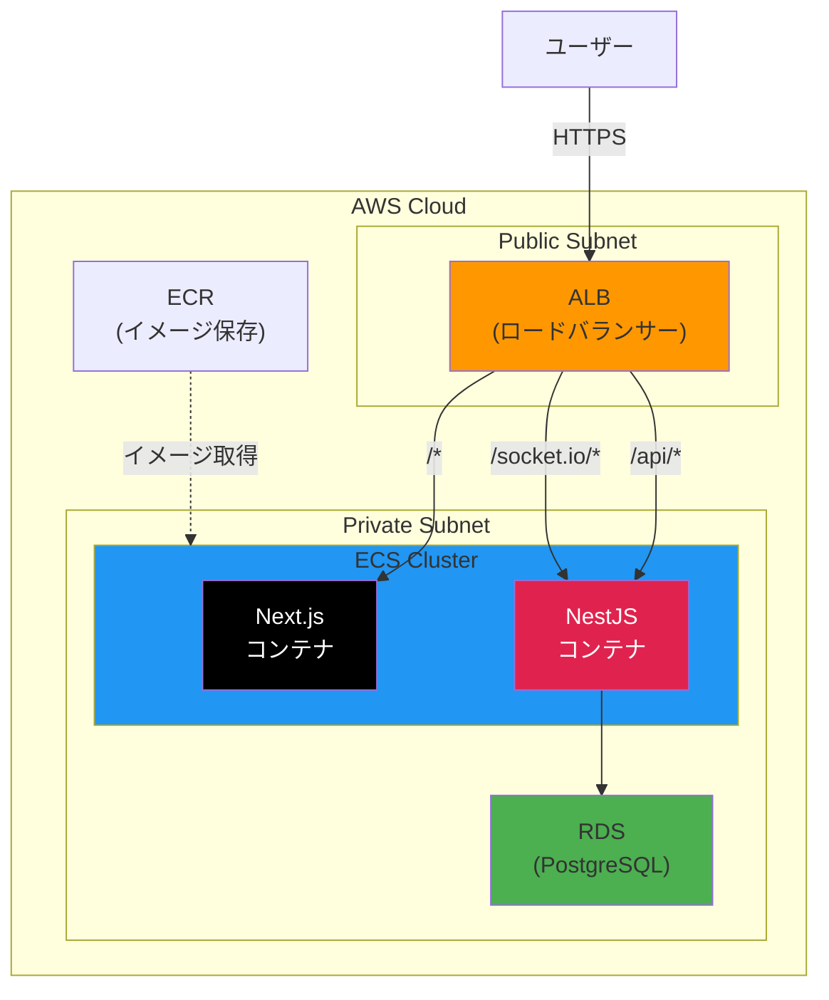
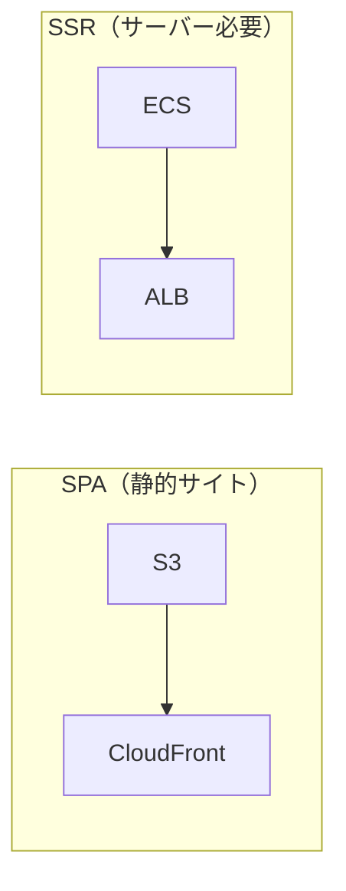
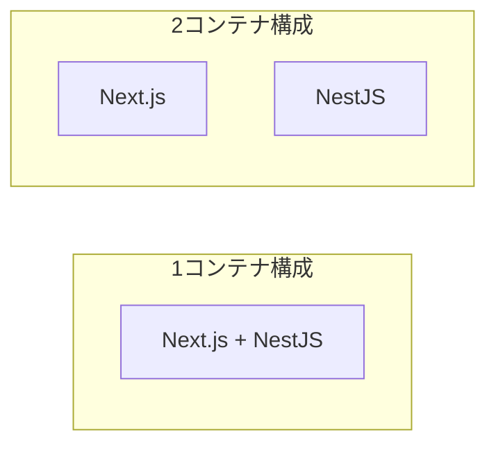
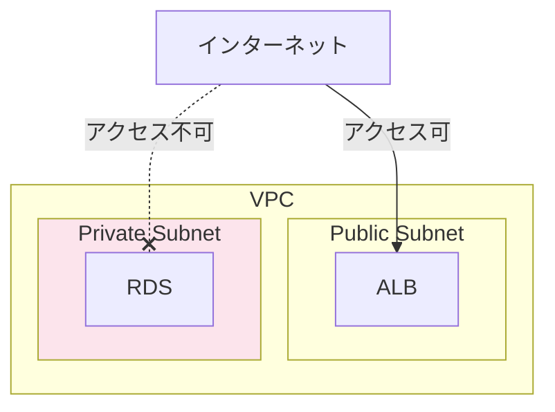

# Part 1: Party Box の構成

[← 目次に戻る](./02-aws.md)

---

## この Part で学ぶこと

- Party Box で使用する技術スタックの理解
- AWS 上でどのように動作するかの全体像
- なぜこの構成を選んだかの設計意図

---

## 技術スタック

| 技術 | 役割 | 補足 |
|------|------|------|
| **Next.js** | フロントエンド | SSR でページ生成、React ベース |
| **NestJS** | バックエンド API | TypeScript、Express ベース |
| **Socket.io** | リアルタイム通信 | ゲーム状態の同期に使用 |
| **PostgreSQL** | データベース | ユーザー、ルーム、ゲーム履歴を保存 |

### SSR（サーバーサイドレンダリング）とは

**CSR（クライアントサイドレンダリング）:**

→ 最初は空白画面が表示される（JS の実行を待つ）

**SSR（サーバーサイドレンダリング）:**

→ 最初から完成した画面が表示される

**SSR のメリット:**
- 初期表示が速い（ユーザー体験向上）
- SEO に有利（検索エンジンが HTML を読める）
- OGP（SNS シェア時のプレビュー）が正しく表示される

---

## AWS 構成図

### リクエストの流れ

1. ユーザーが `https://party-box.example.com` にアクセス
2. **ALB** が HTTPS を受け取り、パスで振り分け
   - `/` → Next.js コンテナ
   - `/api/rooms` → NestJS コンテナ
   - `/socket.io` → NestJS コンテナ（WebSocket）
3. **Next.js** がページを SSR して返す
4. ブラウザで Socket.io 接続を開始
5. ゲーム中は WebSocket でリアルタイム通信

---

## 使用するサービス

| サービス | 正式名称 | 役割 |
|----------|----------|------|
| **VPC** | Virtual Private Cloud | AWS 内のプライベートネットワーク |
| **ALB** | Application Load Balancer | リクエストの振り分け、HTTPS 対応 |
| **ECS** | Elastic Container Service | Docker コンテナの実行・管理 |
| **ECR** | Elastic Container Registry | Docker イメージの保存 |
| **RDS** | Relational Database Service | PostgreSQL データベース |

---

## なぜこの構成？

### Q1: Next.js は S3 + CloudFront じゃダメ？

| 方式 | 適するケース |
|------|-------------|
| **S3 + CloudFront** | 静的サイト、SPA（React/Vue の CSR） |
| **ECS + ALB** | SSR が必要な Next.js、API サーバー |

Party Box は SSR を使うため、サーバー（ECS）が必要。

### Q2: なぜ 2 コンテナに分ける？

| 構成 | メリット | デメリット |
|------|---------|-----------|
| **1 コンテナ** | シンプル、通信が速い | 個別スケール不可 |
| **2 コンテナ** | 個別スケール・デプロイ可 | やや複雑 |

**2 コンテナを選んだ理由:**
- フロントとバックで負荷の特性が違う
  - Next.js: ページ表示（軽い処理が多数）
  - NestJS: ゲームロジック + WebSocket（重い処理が少数）
- バックエンドだけ更新したい時にフロントを再デプロイしなくて済む

### Q3: Fargate と EC2 どっち？

| 方式 | 管理の手間 | コスト | 選ぶ基準 |
|------|-----------|--------|---------|
| **Fargate** | ほぼ不要 | やや高い | 小〜中規模、運用が楽 |
| **EC2** | サーバー管理必要 | 最適化で安くなる | 大規模、コスト最適化したい |

→ Party Box は **Fargate** を選択（運用の手間を減らしたい）

### Q4: なぜ RDS を Private Subnet に置く？

**理由:**
- DB はインターネットに公開する必要がない
- 外部から直接攻撃されるリスクを排除
- ECS からのみアクセスを許可（セキュリティグループで制御）

---

## 構成の比較（シンプル vs 本格）

| 項目 | シンプル構成 | Party Box 構成 |
|------|-------------|----------------|
| コンテナ数 | 1 | 2（フロント + バック） |
| DB | RDS（単一） | RDS（単一） |
| スケーリング | 手動 | Auto Scaling |
| HTTPS | ALB で対応 | ALB で対応 |
| 向いている | 開発・検証 | 本番運用 |

---

## まとめ

- Party Box は **Next.js（SSR）+ NestJS + PostgreSQL** の構成
- AWS では **ECS（Fargate）+ ALB + RDS** で動かす
- フロントとバックを分けることで柔軟にスケールできる
- RDS は Private Subnet に置いてセキュリティを確保

---

[次へ: AWS サービス解説 →](./02-aws-02-services.md)
