# Part 2: AWS サービス解説

[← 目次に戻る](./02-aws.md) | [← 前へ: Party Box の構成](./02-aws-01-party-box.md)

---

## この Part で学ぶこと

- 各 AWS サービスの役割と仕組み
- なぜそのサービスを使うのか
- 実際の設定イメージ

---

## 目次

1. [VPC（ネットワーク）](#vpcネットワーク)
2. [ECS（コンテナ実行）](#ecsコンテナ実行)
3. [ALB（ロードバランサー）](#albロードバランサー)
4. [RDS（データベース）](#rdsデータベース)
5. [ECR（コンテナレジストリ）](#ecrコンテナレジストリ)

---

## VPC（ネットワーク）

**VPC = Virtual Private Cloud**

AWS 内に作る自分専用のプライベートネットワーク。

### 構成要素

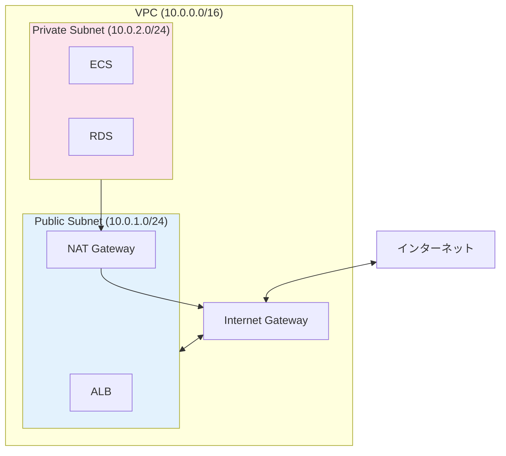

| 要素 | 役割 |
|------|------|
| **VPC** | ネットワーク全体（IP アドレス範囲を定義） |
| **Public Subnet** | インターネットからアクセス可能な領域 |
| **Private Subnet** | インターネットから直接アクセス不可な領域 |
| **Internet Gateway** | VPC とインターネットを接続 |
| **NAT Gateway** | Private Subnet から外部へのアクセスを許可 |

### IP アドレスの読み方

`10.0.0.0/16` = 「10.0.で始まる IP を全部使える」

| CIDR | IP の範囲 | IP 数 |
|------|----------|-------|
| `/16` | 10.0.0.0 〜 10.0.255.255 | 約 65,000 個 |
| `/24` | 10.0.1.0 〜 10.0.1.255 | 256 個 |

### セキュリティグループ

「このサーバーにはどこからの通信を許可するか」を定義するファイアウォール。

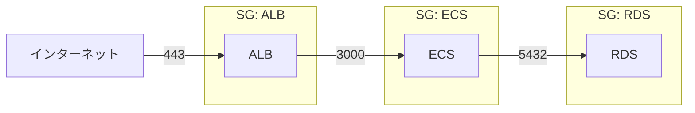

| セキュリティグループ | 許可するトラフィック |
|---------------------|---------------------|
| **ALB 用** | インターネットから 443（HTTPS） |
| **ECS 用** | ALB から 3000（アプリのポート） |
| **RDS 用** | ECS から 5432（PostgreSQL） |

**ポイント:** 必要な通信だけを許可する（最小権限の原則）

### なぜ Private Subnet が必要？

```
❌ RDS を Public に置いた場合:
インターネット → RDS（全世界に公開、攻撃される）

✅ RDS を Private に置いた場合:
インターネット → ALB → ECS → RDS（ECS からのみアクセス可）
```

---

## ECS（コンテナ実行）

**ECS = Elastic Container Service**

Docker コンテナを AWS 上で動かすサービス。

### 用語の階層

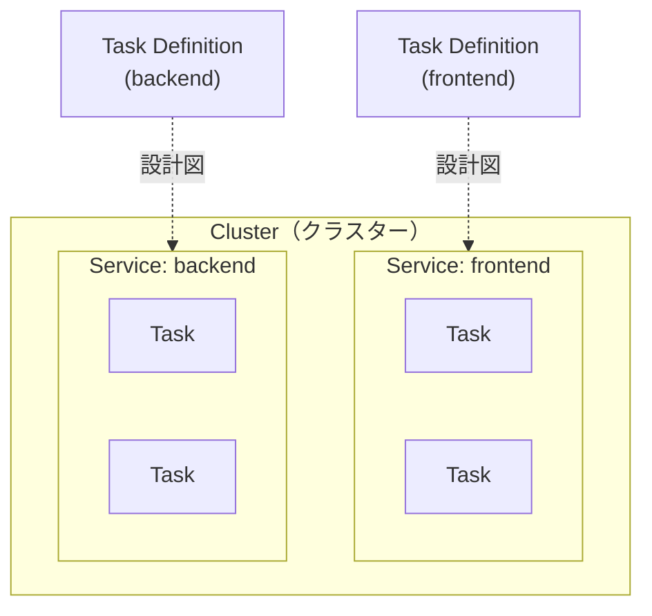

| 用語 | 説明 | 例え |
|------|------|------|
| **Cluster** | コンテナを動かすグループ | 「工場」 |
| **Service** | 何個のコンテナを維持するか管理 | 「生産ライン」 |
| **Task** | 実行中のコンテナ | 「製品」 |
| **Task Definition** | コンテナの設計図（イメージ、CPU、メモリ等） | 「設計書」 |

### Task Definition の例

```json
{
  "family": "party-box-backend",
  "cpu": "256",
  "memory": "512",
  "containerDefinitions": [
    {
      "name": "nestjs",
      "image": "123456789.dkr.ecr.ap-northeast-1.amazonaws.com/backend:latest",
      "portMappings": [
        {
          "containerPort": 3000,
          "protocol": "tcp"
        }
      ],
      "environment": [
        { "name": "NODE_ENV", "value": "production" },
        { "name": "DATABASE_URL", "value": "postgres://..." }
      ]
    }
  ]
}
```

| 項目 | 説明 |
|------|------|
| `cpu` | 使用する CPU（256 = 0.25 vCPU） |
| `memory` | 使用するメモリ（MB） |
| `image` | ECR のイメージ URL |
| `portMappings` | 公開するポート |
| `environment` | 環境変数 |

### Fargate vs EC2

| 項目 | Fargate | EC2 |
|------|---------|-----|
| サーバー管理 | **不要** | 必要（パッチ適用等） |
| スケーリング | 自動 | 設定が必要 |
| コスト | やや高い | 最適化で安くなる |
| 起動速度 | 速い | やや遅い |
| 向いている | 小〜中規模 | 大規模・コスト重視 |

→ Party Box は **Fargate** を採用（運用の手間を最小化）

### Task が複数ある理由

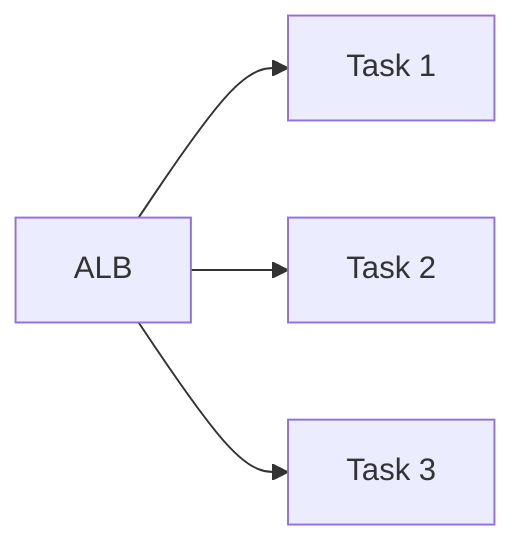

| 理由 | 説明 |
|------|------|
| **負荷分散** | リクエストを複数に分散して処理能力 UP |
| **冗長化** | 1 つ落ちても他が生きてるのでサービス継続 |
| **ローリングデプロイ** | 1 つずつ更新して無停止デプロイ |

---

## ALB（ロードバランサー）

**ALB = Application Load Balancer**

リクエストを複数のコンテナに振り分ける。**リバースプロキシ**として機能。

### 基本的な役割

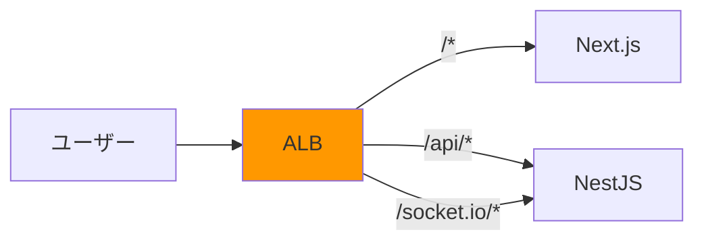

### ALB の主な機能

| 機能 | 説明 |
|------|------|
| **パスルーティング** | URL パスで振り分け先を変える |
| **SSL 終端** | HTTPS の暗号化を ALB で処理 |
| **ヘルスチェック** | 死んだコンテナを自動で除外 |
| **WebSocket 対応** | Socket.io の通信も可能 |

### プロキシとは

**プロキシ（proxy）= 代理。** 通信を中継するサーバーのこと。

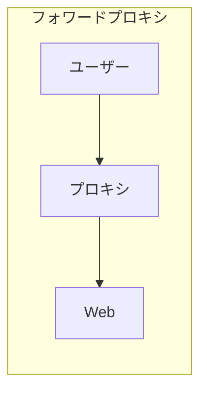

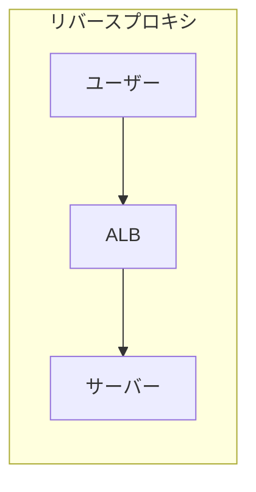

| 種類 | 誰の代理？ | 用途 | 例 |
|------|-----------|------|-----|
| **フォワードプロキシ** | ユーザー | IP 隠し、アクセス制限 | 社内プロキシ |
| **リバースプロキシ** | サーバー | 負荷分散、セキュリティ | ALB, Nginx |

### なぜリバースプロキシが必要？

**リバースプロキシなし:**
```
問題:
- ユーザーがどのサーバーにアクセスするか決められない
- 全サーバーの IP が公開される → 攻撃リスク
- 1 台死んだらそのユーザーは接続断
```

**リバースプロキシあり:**
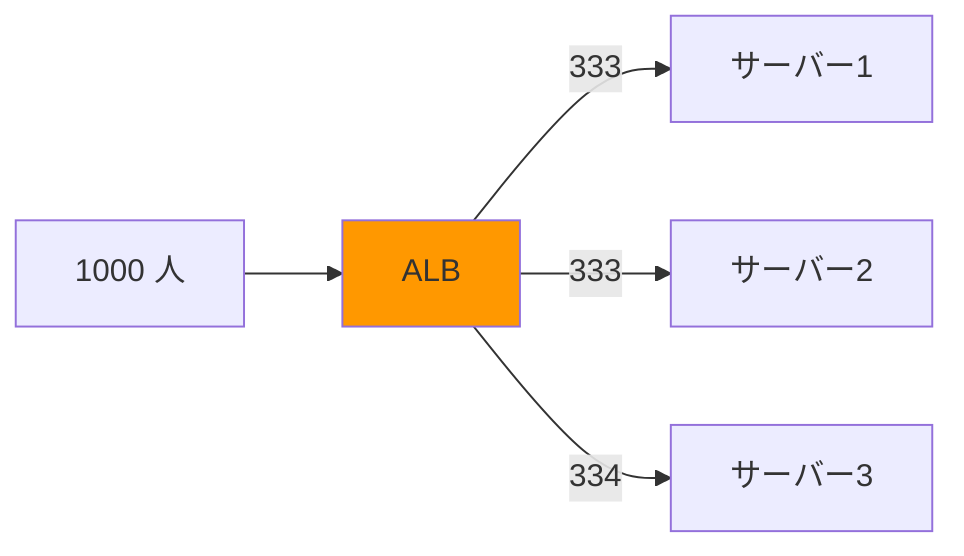

→ ALB が自動で振り分け、サーバー障害も検知して回避

### ヘルスチェックの仕組み

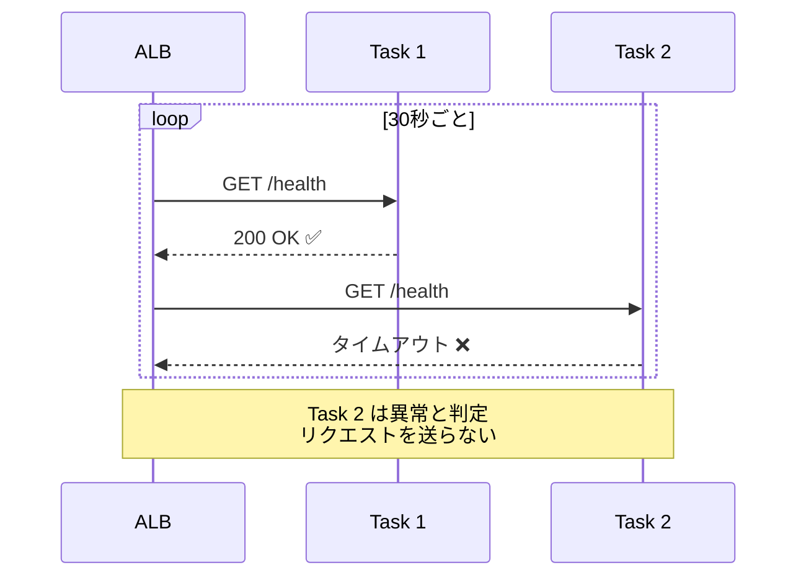

| 設定項目 | 説明 | 例 |
|----------|------|-----|
| パス | チェックする URL | `/health` |
| 間隔 | チェックの頻度 | 30 秒 |
| しきい値 | 何回失敗で異常判定 | 2 回 |

### SSL 終端とは

**SSL/TLS** = HTTPS の暗号化技術

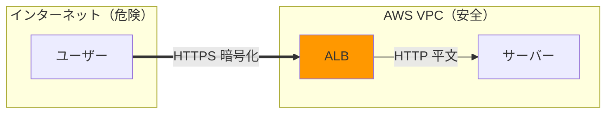

**「終端」= 暗号化された通信が ALB で「終わる」**

| メリット | 説明 |
|---------|------|
| サーバー負荷軽減 | 暗号化処理は重い。ALB に任せる |
| 証明書管理の一元化 | サーバー 10 台でも証明書は ALB に 1 つ |
| VPC 内は安全 | 外部からアクセス不可なので平文 OK |

### SSL 証明書

**「このサイトは本物です」という証明書。** ACM（AWS Certificate Manager）で無料取得。

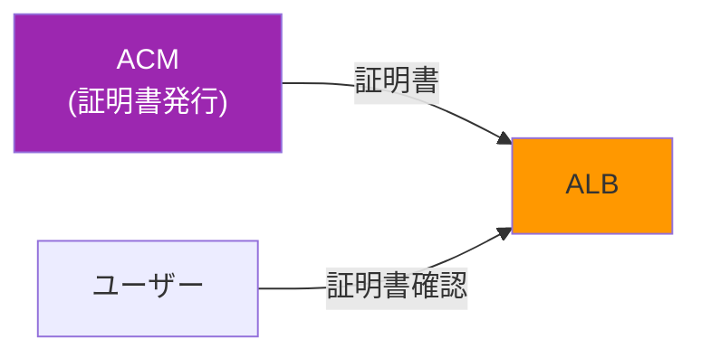

**ACM のメリット:**
- 無料
- 自動更新（期限切れの心配なし）
- ALB にワンクリックで適用

### ターゲットグループ

「ALB が振り分ける先」を定義するもの。

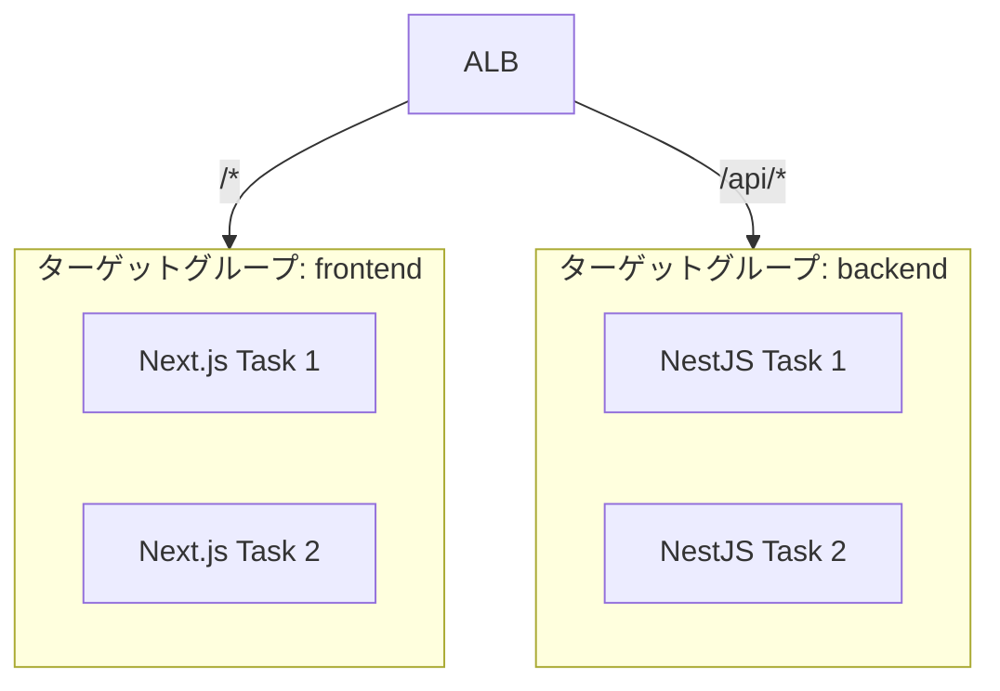

| 設定項目 | 説明 |
|----------|------|
| プロトコル | HTTP or HTTPS |
| ポート | コンテナのポート（例: 3000） |
| ヘルスチェック | 正常性確認の設定 |

### 設計パターン

**パターン 1: モノリス（1 種類）**
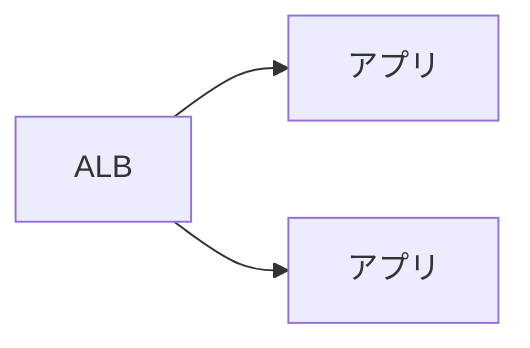

**パターン 2: フロント + バック分離（Party Box）**
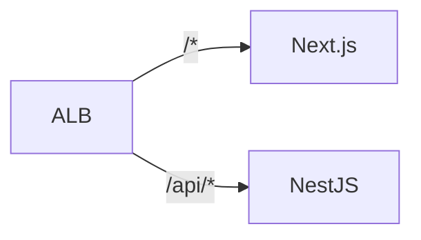

**パターン 3: マイクロサービス**
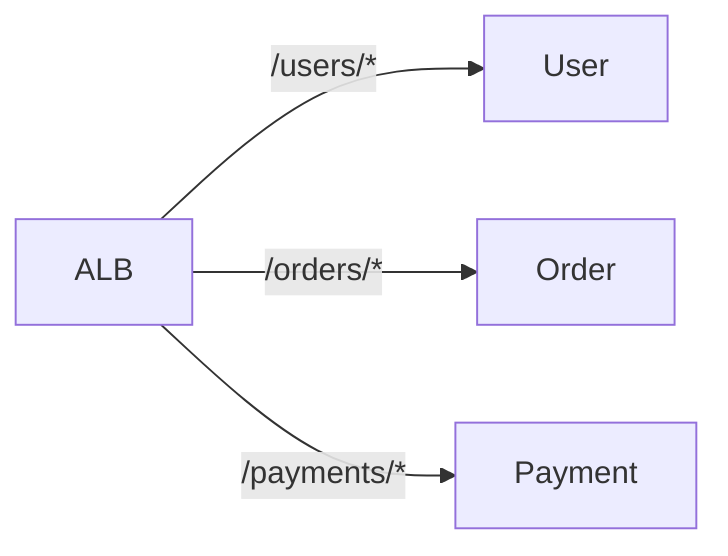

---

## RDS（データベース）

**RDS = Relational Database Service**

マネージド型のリレーショナルデータベース。

### RDS vs 自前 DB

| 項目 | RDS | EC2 に自前インストール |
|------|-----|----------------------|
| バックアップ | **自動** | 自分で設定 |
| パッチ適用 | **自動** | 自分で適用 |
| 障害復旧 | **自動フェイルオーバー** | 自分で構築 |
| スケールアップ | **コンソールから数クリック** | 再構築が必要 |

→ 運用の手間を大幅に削減できる

### 対応エンジン

| エンジン | 説明 |
|----------|------|
| **PostgreSQL** | Party Box で使用 |
| MySQL | 広く使われている |
| Aurora | AWS 独自、高性能 |
| MariaDB | MySQL 互換 |
| Oracle | 商用 DB |
| SQL Server | Microsoft 製 |

### 主な機能

| 機能 | 説明 |
|------|------|
| **自動バックアップ** | 毎日自動でバックアップ、35 日間保持 |
| **Multi-AZ** | 別の AZ にレプリカを作成、障害時に自動切り替え |
| **リードレプリカ** | 読み取り専用のレプリカで負荷分散 |
| **暗号化** | 保存データを暗号化 |

### Multi-AZ とは

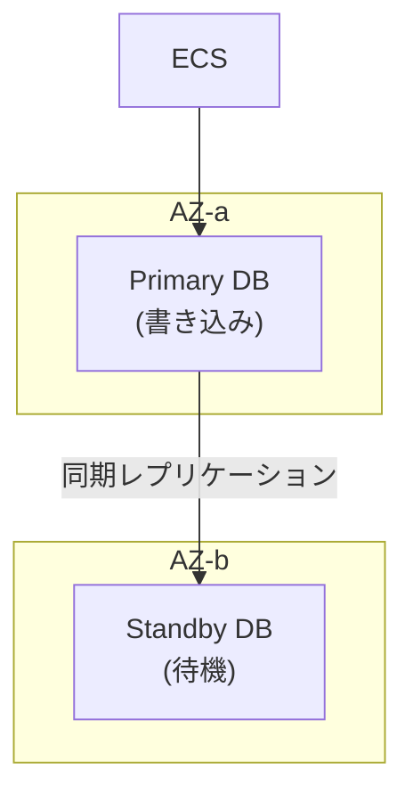

**Primary が落ちた場合:**
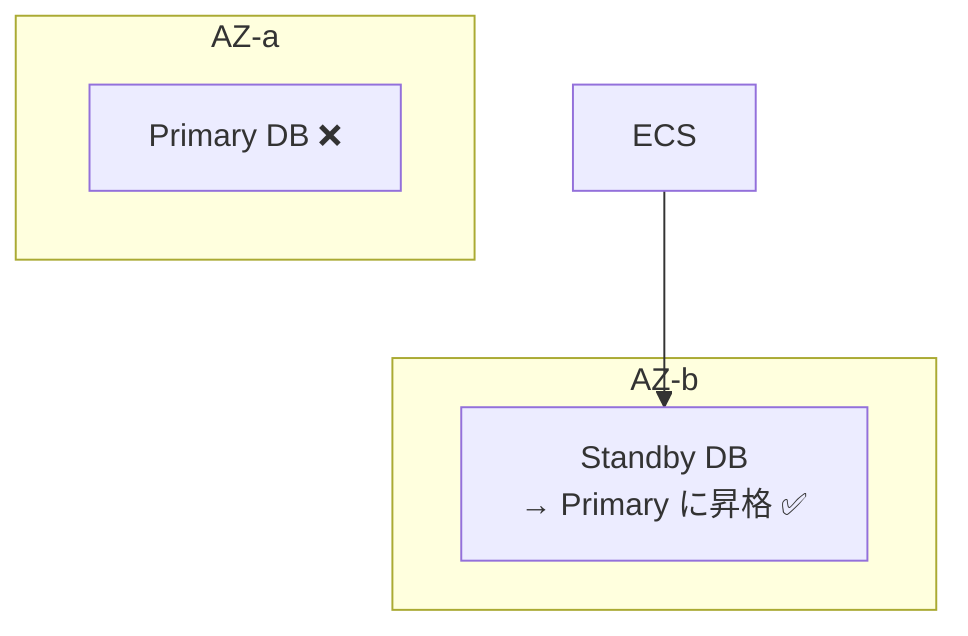

→ 自動でフェイルオーバー、ダウンタイムは通常 1-2 分

### 接続情報の管理

DB の接続情報（パスワード等）は **Secrets Manager** で管理するのがベストプラクティス。

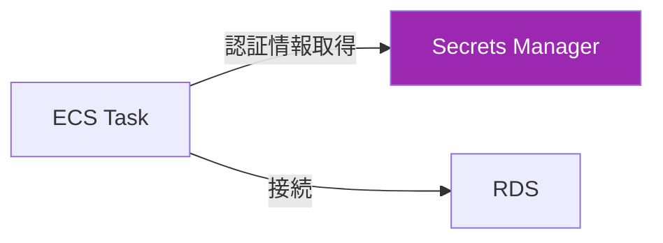

**理由:**
- パスワードをコードに書かなくて済む
- 自動ローテーション可能
- アクセスログが残る

---

## ECR（コンテナレジストリ）

**ECR = Elastic Container Registry**

Docker イメージを保存する場所（AWS 版 Docker Hub）。

### イメージの流れ

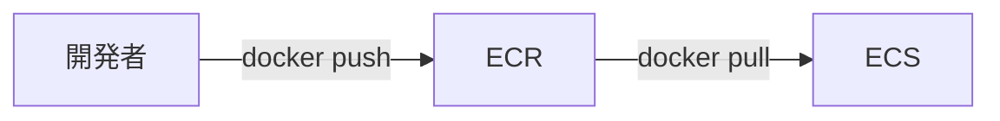

### 基本的なコマンド

```bash
# 1. ECR にログイン
aws ecr get-login-password --region ap-northeast-1 | \
  docker login --username AWS --password-stdin 123456789.dkr.ecr.ap-northeast-1.amazonaws.com

# 2. イメージをビルド
docker build -t party-box-backend .

# 3. タグ付け
docker tag party-box-backend:latest \
  123456789.dkr.ecr.ap-northeast-1.amazonaws.com/party-box-backend:latest

# 4. プッシュ
docker push 123456789.dkr.ecr.ap-northeast-1.amazonaws.com/party-box-backend:latest
```

### 便利な機能

| 機能 | 説明 |
|------|------|
| **イメージスキャン** | 脆弱性を自動チェック |
| **ライフサイクルポリシー** | 古いイメージを自動削除 |
| **暗号化** | イメージを暗号化して保存 |

### ライフサイクルポリシーの例

「タグのないイメージは 7 日後に削除」

```json
{
  "rules": [
    {
      "rulePriority": 1,
      "description": "Remove untagged images after 7 days",
      "selection": {
        "tagStatus": "untagged",
        "countType": "sinceImagePushed",
        "countUnit": "days",
        "countNumber": 7
      },
      "action": {
        "type": "expire"
      }
    }
  ]
}
```

→ ストレージコストを抑えられる

---

## まとめ

| サービス | 一言で説明 |
|----------|-----------|
| **VPC** | AWS 内のプライベートネットワーク |
| **ECS** | Docker コンテナを動かす |
| **ALB** | リクエストを振り分ける・HTTPS 対応 |
| **RDS** | マネージド DB（バックアップ自動） |
| **ECR** | Docker イメージを保存 |

---

[次へ: スケーリング →](./02-aws-03-scaling.md)
