# Part 3: スケーリング

[← 目次に戻る](./02-aws.md) | [← 前へ: AWS サービス解説](./02-aws-02-services.md)

---

## この Part で学ぶこと

- スケーリングとは何か
- ECS での Auto Scaling の仕組み
- スケーリングポリシーの種類と設定

---

## スケーリングとは

負荷に応じてサーバー（コンテナ）の数を増減すること。

### スケールアップ vs スケールアウト

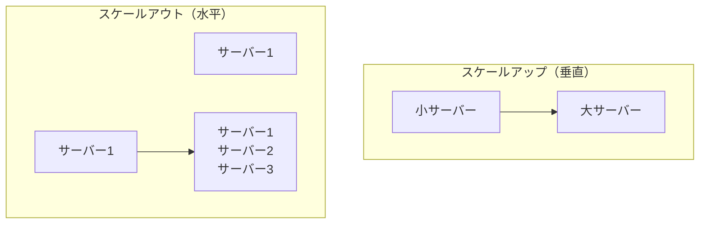

| 種類 | 説明 | メリット | デメリット |
|------|------|---------|-----------|
| **スケールアップ** | 1 台を強化 | 簡単 | 限界がある、ダウンタイム発生 |
| **スケールアウト** | 台数を増やす | 限界なし、無停止 | 設計が必要 |

→ ECS では **スケールアウト**（コンテナ数を増減）を使う

---

## Auto Scaling の仕組み

負荷に応じて自動でコンテナを増減する機能。

### 全体の流れ

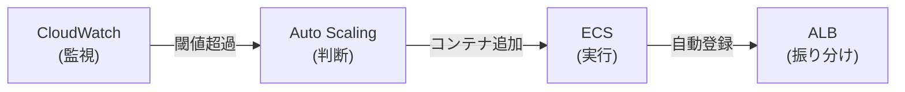

### 具体的な動き

**1. 通常時（Task 2 個）**
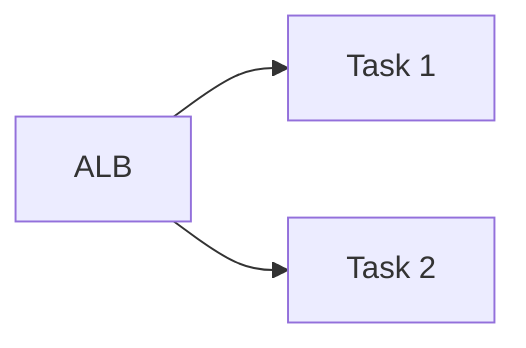

**2. 負荷上昇 → スケールアウト（Task 4 個）**
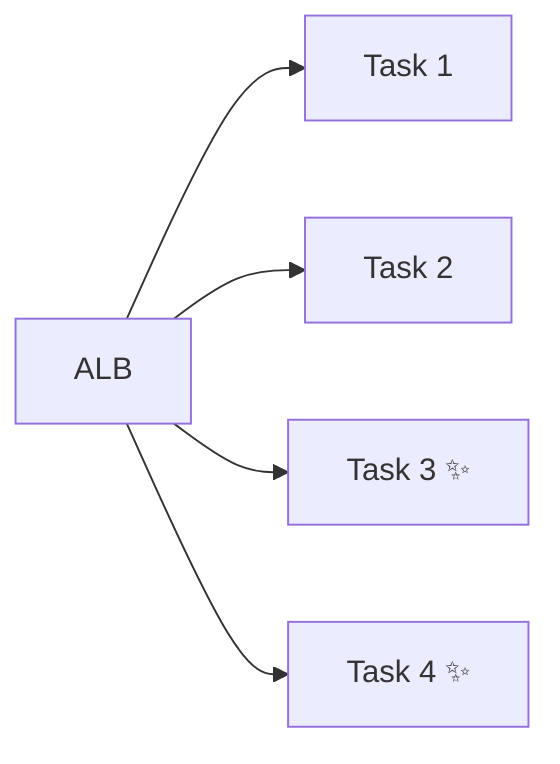

**3. 負荷減少 → スケールイン（Task 2 個に戻る）**


---

## CloudWatch（監視）

AWS のリソースを監視するサービス。

### 監視できる主なメトリクス

| メトリクス | 説明 | 用途 |
|-----------|------|------|
| **CPUUtilization** | CPU 使用率 | 処理負荷の監視 |
| **MemoryUtilization** | メモリ使用率 | メモリ負荷の監視 |
| **RequestCount** | リクエスト数 | トラフィック量の監視 |
| **ResponseTime** | レスポンス時間 | パフォーマンス監視 |

### アラームの設定例

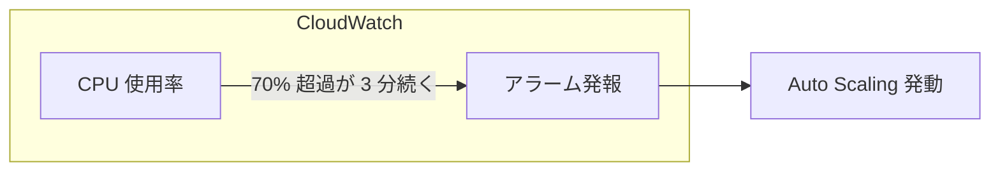

---

## スケーリングポリシー

「どういう条件で、どれだけスケールするか」を定義するルール。

### 3 種類のポリシー

| ポリシー | 説明 | 使い所 |
|---------|------|-------|
| **Target Tracking** | 目標値を維持 | 最もシンプル、推奨 |
| **Step Scaling** | 段階的にスケール | 細かい制御が必要な場合 |
| **Scheduled Scaling** | 時間指定でスケール | 予測可能な負荷パターン |

### Target Tracking（推奨）

「CPU 使用率を 70% に保つ」のように目標を設定。AWS が自動で調整。

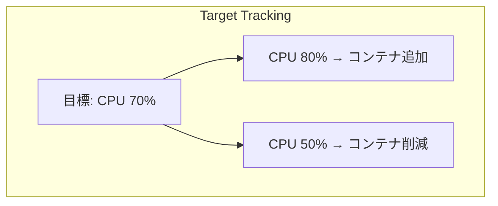

**設定例:**
```json
{
  "TargetTrackingScalingPolicyConfiguration": {
    "TargetValue": 70.0,
    "PredefinedMetricSpecification": {
      "PredefinedMetricType": "ECSServiceAverageCPUUtilization"
    },
    "ScaleOutCooldown": 60,
    "ScaleInCooldown": 300
  }
}
```

| 項目 | 説明 |
|------|------|
| `TargetValue` | 目標 CPU 使用率（%） |
| `ScaleOutCooldown` | スケールアウト後の待機時間（秒） |
| `ScaleInCooldown` | スケールイン後の待機時間（秒） |

### Step Scaling

段階的にスケールする。細かい制御が必要な場合に使用。

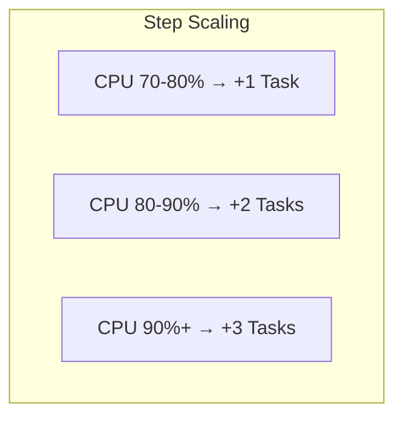

**設定例:**
```
CPU 70-80%  → Task +1
CPU 80-90%  → Task +2
CPU 90%以上 → Task +3
```

### Scheduled Scaling

予測可能な負荷に対応。例：昼休みに負荷が増える。

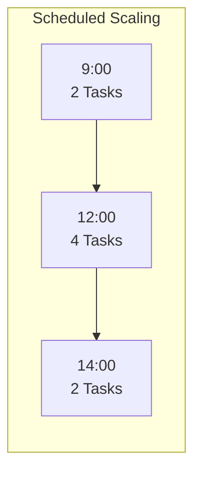

**設定例:**
```
毎日 12:00 → 最小 4 Tasks
毎日 14:00 → 最小 2 Tasks
```

---

## クールダウン期間

スケーリング後に一定時間待機する設定。

### なぜ必要？

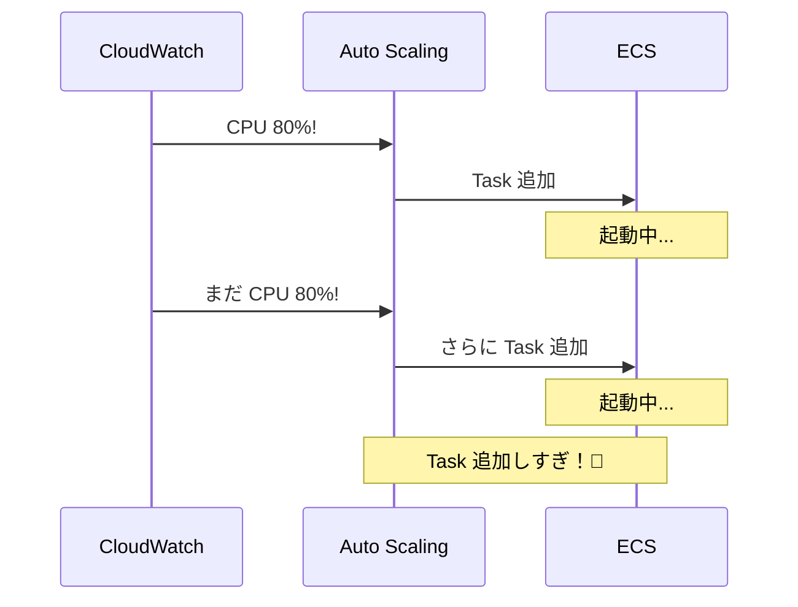

**クールダウンがあると:**
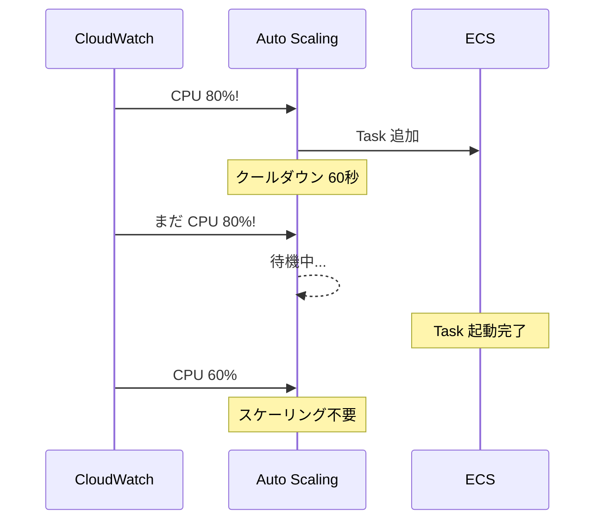

### 推奨設定

| 設定 | 推奨値 | 理由 |
|------|-------|------|
| **スケールアウト** | 60 秒 | 素早く対応したい |
| **スケールイン** | 300 秒 | 急な削減を避けたい |

---

## 最小・最大 Task 数

スケーリングの範囲を制限する設定。

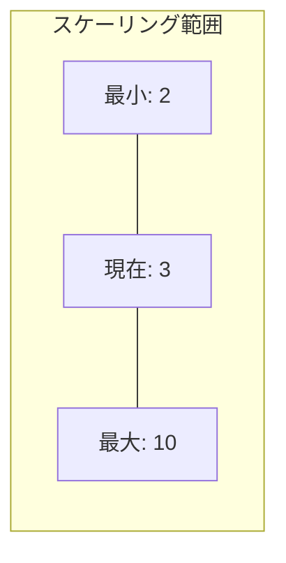

| 設定 | 推奨 | 理由 |
|------|------|------|
| **最小** | 2 | 冗長化のため最低 2 つは動かす |
| **最大** | 負荷に応じて | コスト上限を設ける |

**注意:** 最大を設定しないと、障害時に無限にスケールしてコストが爆発する可能性がある。

---

## Party Box での設定例

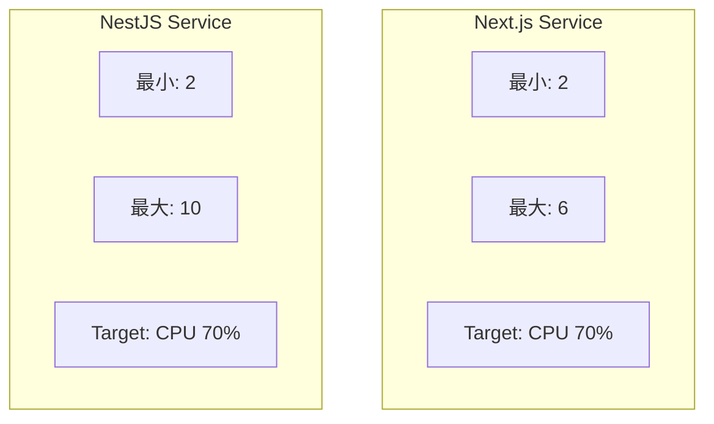

| Service | 最小 | 最大 | ポリシー |
|---------|------|------|---------|
| **Next.js** | 2 | 6 | Target Tracking (CPU 70%) |
| **NestJS** | 2 | 10 | Target Tracking (CPU 70%) |

**バックエンドの最大が多い理由:**
- WebSocket 接続を維持するため
- ゲームロジックの処理が重い

---

## スケーリングの監視

CloudWatch ダッシュボードで確認できる項目：

| 項目 | 確認内容 |
|------|---------|
| Task 数の推移 | スケーリングが適切に動作しているか |
| CPU/メモリ使用率 | リソースが不足していないか |
| リクエスト数 | トラフィックの変動パターン |
| エラー率 | スケーリング時に問題が起きていないか |

---

## まとめ

| 項目 | 内容 |
|------|------|
| **Auto Scaling** | 負荷に応じてコンテナを自動増減 |
| **Target Tracking** | 目標値を設定するだけでOK（推奨） |
| **クールダウン** | スケーリング後の待機時間を設定 |
| **最小/最大** | スケーリングの範囲を制限（コスト管理） |

---

[次へ: 発展 →](./02-aws-04-advanced.md)
