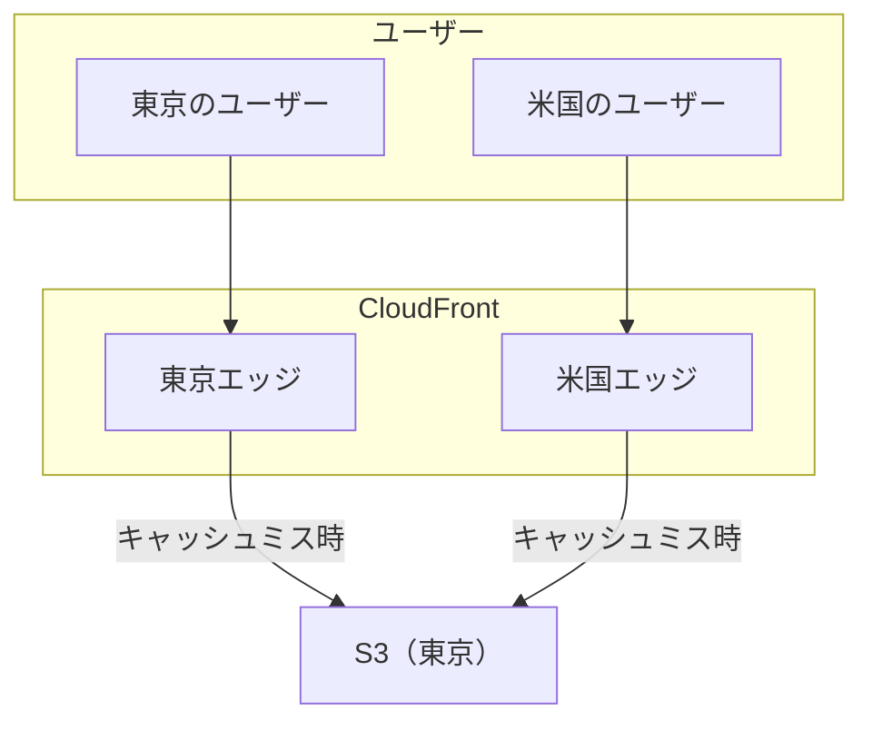
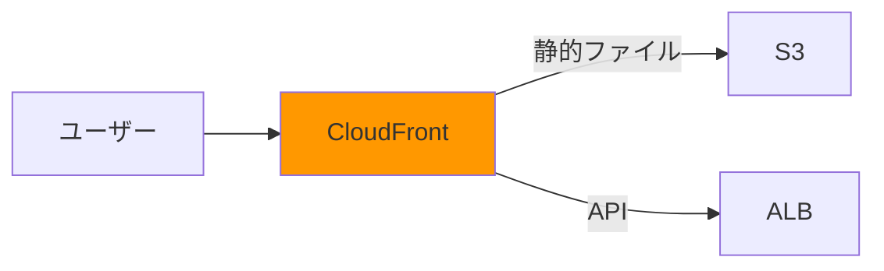
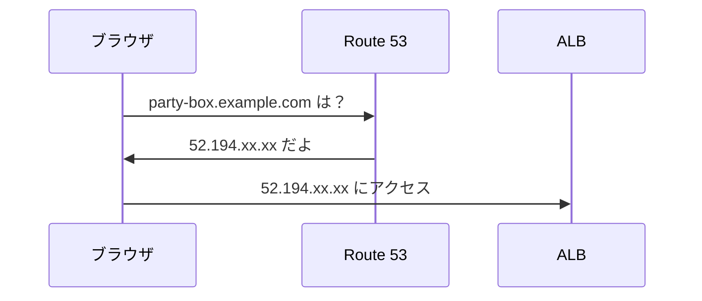
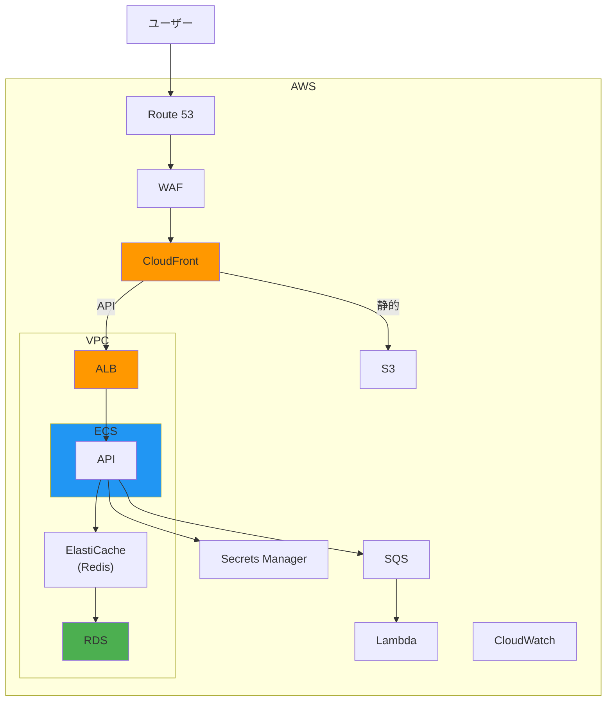
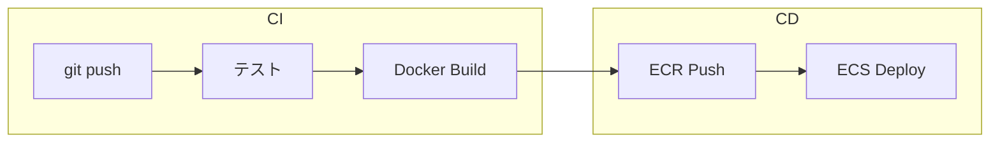

# Part 4: 発展

[← 目次に戻る](./02-aws.md) | [← 前へ: スケーリング](./02-aws-03-scaling.md)

---

## この Part で学ぶこと

- Party Box 以上の規模で使うサービス
- CI/CD パイプラインの構築
- インフラのコード化（IaC）

---

## S3 と CloudFront

Party Box では必須ではないが、よく使うので理解しておこう。

### S3（Simple Storage Service）

オブジェクトストレージ。ファイルを保存する場所。

| 用途 | 例 |
|------|-----|
| 静的ファイル | HTML, CSS, JS, 画像 |
| バックアップ | DB のダンプファイル |
| ログ | アクセスログ、エラーログ |
| メディア | ユーザーがアップロードした画像 |

### CloudFront（CDN）

世界中のエッジサーバーからコンテンツを配信。



**メリット:**
- ユーザーに近いサーバーから配信 → 高速
- S3 への直接アクセスを減らす → コスト削減
- DDoS 対策（AWS Shield と統合）

### S3 + CloudFront の構成



**設定のポイント:**
- `/api/*` → ALB（API サーバー）
- `/*` → S3（静的ファイル）
- オリジンアクセスコントロール（OAC）で S3 を非公開に

---

## Route 53（DNS）

AWS のマネージド DNS サービス。

### DNS とは

ドメイン名（`example.com`）を IP アドレスに変換する仕組み。



### Route 53 の機能

| 機能 | 説明 |
|------|------|
| **ドメイン登録** | ドメインを購入できる |
| **DNS ホスティング** | DNS レコードを管理 |
| **ヘルスチェック** | エンドポイントの監視 |
| **ルーティングポリシー** | 負荷分散、地理的ルーティング |

### レコードタイプ

| タイプ | 用途 | 例 |
|--------|------|-----|
| **A** | ドメイン → IP | `example.com → 52.194.xx.xx` |
| **CNAME** | ドメイン → 別ドメイン | `www.example.com → example.com` |
| **ALIAS** | ドメイン → AWS リソース | `example.com → ALB` |

---

## 大規模構成の例

EC サイトのような本番構成：



### 追加サービスの説明

| サービス | 役割 | なぜ必要？ |
|----------|------|----------|
| **WAF** | ファイアウォール | SQL インジェクション等を防ぐ |
| **ElastiCache** | Redis キャッシュ | DB アクセスを減らして高速化 |
| **SQS** | メッセージキュー | 非同期処理（メール送信等） |
| **Lambda** | サーバーレス関数 | 画像リサイズ等の処理 |
| **Secrets Manager** | 秘密情報管理 | DB パスワード等を安全に保存 |
| **CloudWatch** | 監視・ログ | メトリクス、ログ、アラート |

---

## CI/CD パイプライン

コード変更 → 自動テスト → 自動デプロイの流れ。

### CI/CD とは

| 用語 | 説明 |
|------|------|
| **CI（継続的インテグレーション）** | コード変更を自動でテスト |
| **CD（継続的デリバリー/デプロイ）** | テスト通過後に自動でデプロイ |

### パイプラインの流れ



### GitHub Actions の例

```yaml
name: Deploy to ECS

on:
  push:
    branches: [main]

jobs:
  deploy:
    runs-on: ubuntu-latest
    steps:
      # コードをチェックアウト
      - uses: actions/checkout@v4

      # テスト実行
      - name: Run tests
        run: npm test

      # AWS 認証
      - name: Configure AWS credentials
        uses: aws-actions/configure-aws-credentials@v4
        with:
          aws-access-key-id: ${{ secrets.AWS_ACCESS_KEY_ID }}
          aws-secret-access-key: ${{ secrets.AWS_SECRET_ACCESS_KEY }}
          aws-region: ap-northeast-1

      # ECR にログイン
      - name: Login to ECR
        uses: aws-actions/amazon-ecr-login@v2

      # イメージをビルド＆プッシュ
      - name: Build and push image
        run: |
          docker build -t $ECR_REGISTRY/backend:${{ github.sha }} .
          docker push $ECR_REGISTRY/backend:${{ github.sha }}

      # ECS にデプロイ
      - name: Deploy to ECS
        uses: aws-actions/amazon-ecs-deploy-task-definition@v1
        with:
          task-definition: task-definition.json
          service: backend
          cluster: party-box
```

### AWS の CI/CD サービス

| サービス | 役割 |
|----------|------|
| **CodeCommit** | Git リポジトリ（GitHub の AWS 版） |
| **CodeBuild** | ビルド・テスト（GitHub Actions の build） |
| **CodeDeploy** | デプロイ |
| **CodePipeline** | 上記を連携するパイプライン |

→ GitHub Actions を使うのが一般的。AWS 内で完結したい場合は CodePipeline。

---

## インフラのコード化（IaC）

**IaC = Infrastructure as Code**

インフラをコードで管理し、手動でポチポチ作らない。

### なぜ IaC？

| 手動構築の問題 | IaC で解決 |
|---------------|-----------|
| 手順書通りにやっても微妙に違う | コードなので完全に同じ |
| 誰が何を変更したか分からない | Git で履歴が残る |
| 環境を作り直すのが大変 | コマンド一発で再現 |
| 設定ミスに気づきにくい | レビューで発見できる |

### 主なツール

| ツール | 提供元 | 特徴 |
|--------|-------|------|
| **Terraform** | HashiCorp | マルチクラウド対応、最も人気 |
| **CloudFormation** | AWS | AWS 専用、追加コスト無し |
| **CDK** | AWS | プログラミング言語で書ける |
| **Pulumi** | Pulumi | プログラミング言語で書ける |

### Terraform の例

```hcl
# VPC の作成
resource "aws_vpc" "main" {
  cidr_block = "10.0.0.0/16"

  tags = {
    Name = "party-box-vpc"
  }
}

# ECS クラスターの作成
resource "aws_ecs_cluster" "main" {
  name = "party-box-cluster"
}

# ECS サービスの作成
resource "aws_ecs_service" "backend" {
  name            = "backend"
  cluster         = aws_ecs_cluster.main.id
  task_definition = aws_ecs_task_definition.backend.arn
  desired_count   = 2
  launch_type     = "FARGATE"

  network_configuration {
    subnets         = [aws_subnet.private.id]
    security_groups = [aws_security_group.ecs.id]
  }

  load_balancer {
    target_group_arn = aws_lb_target_group.backend.arn
    container_name   = "nestjs"
    container_port   = 3000
  }
}
```

### Terraform の使い方

```bash
# 1. 初期化
terraform init

# 2. 変更内容を確認（ドライラン）
terraform plan

# 3. 適用
terraform apply

# 4. 削除
terraform destroy
```

### CloudFormation の例

```yaml
AWSTemplateFormatVersion: '2010-09-09'

Resources:
  ECSCluster:
    Type: AWS::ECS::Cluster
    Properties:
      ClusterName: party-box-cluster

  ECSService:
    Type: AWS::ECS::Service
    Properties:
      ServiceName: backend
      Cluster: !Ref ECSCluster
      TaskDefinition: !Ref TaskDefinition
      DesiredCount: 2
      LaunchType: FARGATE
```

### Terraform vs CloudFormation

| 項目 | Terraform | CloudFormation |
|------|-----------|----------------|
| 対応クラウド | AWS, GCP, Azure 等 | AWS のみ |
| 状態管理 | S3 等に保存 | AWS が管理 |
| 学習コスト | やや高い | 低い |
| エコシステム | 豊富なモジュール | AWS 公式サンプル |

→ マルチクラウドなら Terraform、AWS 専用なら CloudFormation でも OK

---

## コスト最適化

### コストを抑えるポイント

| ポイント | 説明 |
|---------|------|
| **適切なインスタンスサイズ** | 過剰なリソースを避ける |
| **リザーブドインスタンス** | 長期利用なら 30-70% 割引 |
| **Savings Plans** | コミットメント割引 |
| **スポットインスタンス** | 中断可能なワークロードに最大 90% 割引 |
| **Auto Scaling** | 必要な時だけスケール |
| **不要リソースの削除** | 使ってない EIP、スナップショット等 |

### コスト監視

| サービス | 用途 |
|----------|------|
| **Cost Explorer** | コストの可視化・分析 |
| **Budgets** | 予算アラートの設定 |
| **Cost Anomaly Detection** | 異常なコスト増を検知 |

---

## まとめ

| 項目 | 内容 |
|------|------|
| **S3 + CloudFront** | 静的ファイルの高速配信 |
| **Route 53** | DNS 管理 |
| **CI/CD** | 自動テスト・自動デプロイ |
| **IaC** | インフラをコードで管理 |
| **コスト最適化** | 適切なサイズ、割引プラン活用 |

---

[次へ: 課題 →](./02-aws-05-exercises.md)
