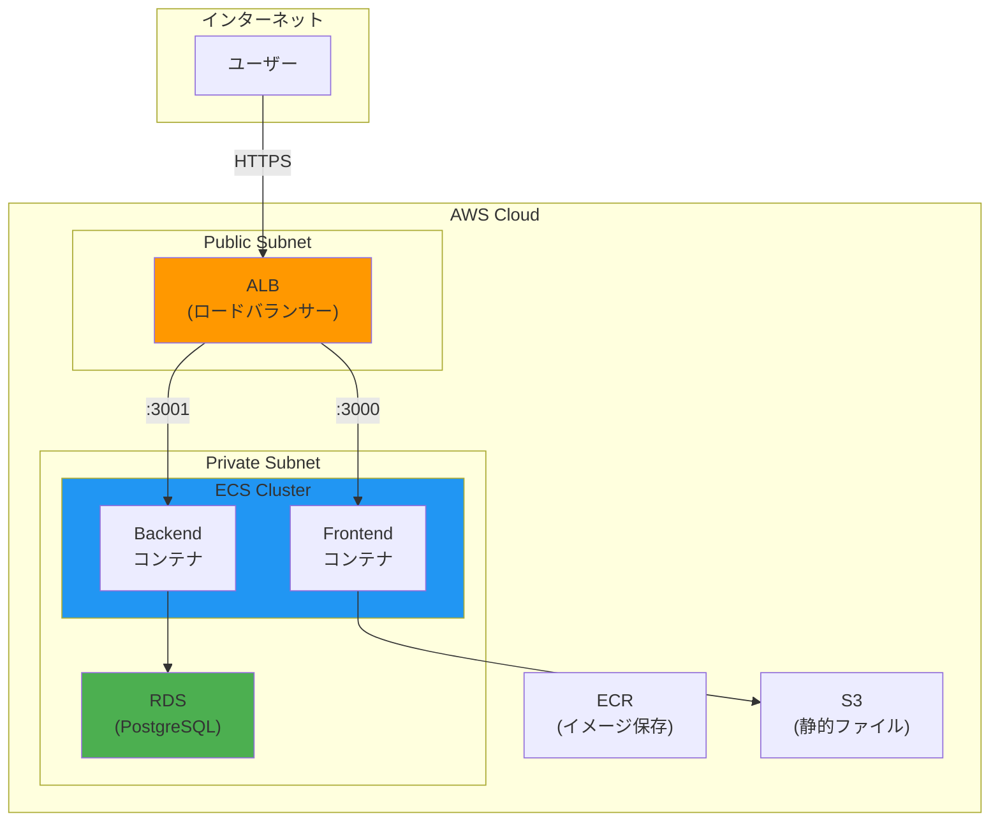
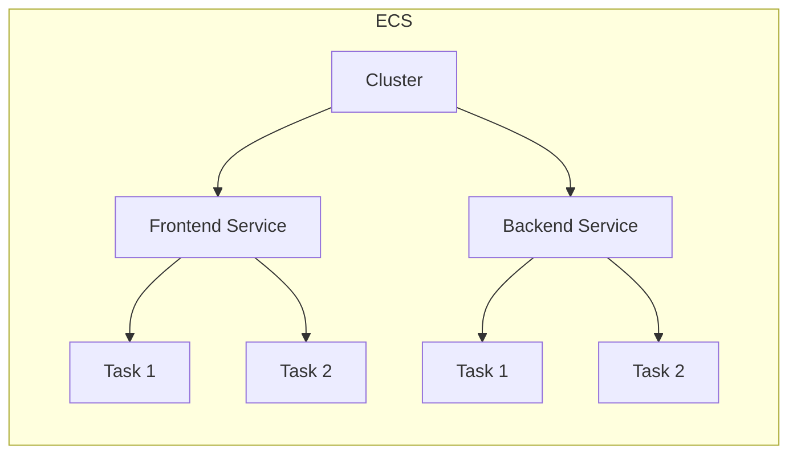
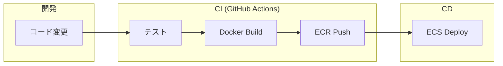

# 02. AWS 構成

## 概要

AWS (Amazon Web Services) はクラウドインフラの代表格。
Party Box のような Web アプリを本番運用するための構成を学ぶ。

## なぜ AWS を学ぶのか

- 業界標準のクラウドプラットフォーム
- スケーラブルなインフラを構築できる
- 多くの企業で採用されている
- 他のクラウド（GCP, Azure）も概念は共通

---

## コア概念

### 主要サービス一覧

| サービス | 役割 | 例え |
|----------|------|------|
| **EC2** | 仮想サーバー | レンタルサーバー |
| **ECS** | コンテナ実行環境 | Docker のマネージド版 |
| **ECR** | コンテナレジストリ | Docker Hub の AWS 版 |
| **RDS** | マネージドDB | PostgreSQL/MySQL のホスティング |
| **S3** | オブジェクトストレージ | ファイル置き場 |
| **ALB** | ロードバランサー | 負荷分散装置 |
| **CloudFront** | CDN | 静的ファイル配信 |
| **Route 53** | DNS | ドメイン管理 |
| **VPC** | 仮想ネットワーク | プライベートネットワーク |

---

## Party Box の想定構成



---

## 各サービスの詳細

### 1. VPC (Virtual Private Cloud)

AWS 内に作る自分専用のネットワーク空間。

```
VPC (10.0.0.0/16)
├── Public Subnet (10.0.1.0/24)  ← インターネットからアクセス可能
│   └── ALB, NAT Gateway
└── Private Subnet (10.0.2.0/24) ← インターネットから直接アクセス不可
    └── ECS, RDS
```

### 2. ECS (Elastic Container Service)

Docker コンテナを AWS 上で実行するサービス。

**構成要素:**
- **Cluster**: コンテナを動かす論理的なグループ
- **Task Definition**: コンテナの設定（Dockerfile の実行版）
- **Service**: Task を何個動かすか、どう分散するか
- **Task**: 実行中のコンテナ



### 3. ECR (Elastic Container Registry)

Docker イメージを保存するプライベートレジストリ。

```bash
# イメージをビルド
docker build -t my-app .

# ECR にログイン
aws ecr get-login-password | docker login --username AWS --password-stdin <account>.dkr.ecr.<region>.amazonaws.com

# タグ付け
docker tag my-app:latest <account>.dkr.ecr.<region>.amazonaws.com/my-app:latest

# プッシュ
docker push <account>.dkr.ecr.<region>.amazonaws.com/my-app:latest
```

### 4. ALB (Application Load Balancer)

HTTP/HTTPS トラフィックを複数のコンテナに分散。

**機能:**
- パスベースルーティング (`/api/*` → Backend, `/*` → Frontend)
- SSL/TLS 終端
- ヘルスチェック
- WebSocket サポート

```
ALB
├── /api/*      → Backend Target Group (port 3001)
├── /socket.io/* → Backend Target Group (port 3001, sticky session)
└── /*          → Frontend Target Group (port 3000)
```

### 5. RDS (Relational Database Service)

マネージド型データベース。バックアップ、パッチ適用を AWS が管理。

```
RDS PostgreSQL
├── Multi-AZ: 可用性のため複数AZにレプリカ
├── Automated Backups: 自動バックアップ
└── Security Group: アクセス制御
```

---

## Fargate vs EC2

ECS でコンテナを動かす方式は2つ:

| 項目 | Fargate | EC2 |
|------|---------|-----|
| サーバー管理 | 不要（サーバーレス） | 必要 |
| スケーリング | 自動 | 設定が必要 |
| コスト | やや高い | 最適化すれば安い |
| 柔軟性 | 制限あり | 高い |

**小〜中規模なら Fargate がおすすめ**（管理コストが低い）

---

## インフラコード化 (IaC)

AWS リソースをコードで管理する方法。

### Terraform の例

```hcl
# ECS クラスター
resource "aws_ecs_cluster" "main" {
  name = "party-box-cluster"
}

# ECS サービス
resource "aws_ecs_service" "backend" {
  name            = "backend"
  cluster         = aws_ecs_cluster.main.id
  task_definition = aws_ecs_task_definition.backend.arn
  desired_count   = 2
  launch_type     = "FARGATE"

  load_balancer {
    target_group_arn = aws_lb_target_group.backend.arn
    container_name   = "backend"
    container_port   = 3001
  }
}
```

### AWS CDK の例 (TypeScript)

```typescript
import * as ecs from 'aws-cdk-lib/aws-ecs';

const cluster = new ecs.Cluster(this, 'Cluster', {
  vpc: vpc,
});

const backendService = new ecs.FargateService(this, 'BackendService', {
  cluster,
  taskDefinition: backendTask,
  desiredCount: 2,
});
```

---

## CI/CD パイプライン



### GitHub Actions の例

```yaml
name: Deploy to ECS

on:
  push:
    branches: [main]

jobs:
  deploy:
    runs-on: ubuntu-latest
    steps:
      - uses: actions/checkout@v4

      - name: Configure AWS credentials
        uses: aws-actions/configure-aws-credentials@v4
        with:
          aws-access-key-id: ${{ secrets.AWS_ACCESS_KEY_ID }}
          aws-secret-access-key: ${{ secrets.AWS_SECRET_ACCESS_KEY }}
          aws-region: ap-northeast-1

      - name: Login to ECR
        uses: aws-actions/amazon-ecr-login@v2

      - name: Build and push
        run: |
          docker build -t $ECR_REGISTRY/backend:${{ github.sha }} ./backend
          docker push $ECR_REGISTRY/backend:${{ github.sha }}

      - name: Deploy to ECS
        uses: aws-actions/amazon-ecs-deploy-task-definition@v1
        with:
          task-definition: task-definition.json
          service: backend
          cluster: party-box-cluster
```

---

## コスト最適化のポイント

1. **Fargate Spot**: 最大70%割引（中断される可能性あり）
2. **Reserved Instances**: 長期利用で割引
3. **Auto Scaling**: 負荷に応じてコンテナ数を調整
4. **適切なサイズ選択**: 過剰スペックを避ける

---

## ハンズオン課題

### 課題 1: AWS アカウント作成

1. AWS アカウントを作成
2. IAM ユーザーを作成（ルートユーザーは使わない）
3. MFA を有効化

### 課題 2: 構成図を書く

Party Box を本番運用する場合の AWS 構成図を自分で書いてみよう。
- どのサービスを使うか
- ネットワーク構成はどうするか
- セキュリティはどう担保するか

### 課題 3: 料金見積もり

[AWS Pricing Calculator](https://calculator.aws/) で Party Box の月額コストを見積もってみよう。

---

## 参考リソース

- [AWS 公式ドキュメント](https://docs.aws.amazon.com/)
- [AWS Well-Architected Framework](https://aws.amazon.com/architecture/well-architected/)
- [AWS Skill Builder](https://skillbuilder.aws/) - 無料学習コンテンツ
- [Terraform AWS Provider](https://registry.terraform.io/providers/hashicorp/aws/latest/docs)

---

## チェックリスト

- [ ] VPC、Subnet の概念を理解している
- [ ] ECS の構成要素（Cluster, Service, Task）を説明できる
- [ ] ALB の役割を理解している
- [ ] Fargate と EC2 の違いを説明できる
- [ ] IaC (Terraform/CDK) の利点を理解している
