# 02. AWS 構成

## この章で学ぶこと

Party Box を AWS で本番運用するための構成を学ぶ。

1. Party Box の技術スタックと AWS 構成
2. 使用する AWS サービスの役割
3. スケーリングの仕組み
4. 発展的な構成（EC サイトの例）

---

# Part 1: Party Box の構成

## 技術スタック

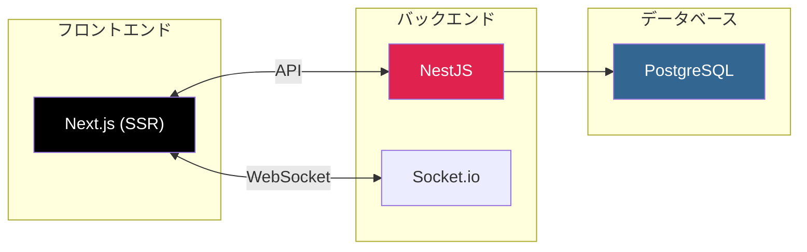

| 技術 | 役割 |
|------|------|
| **Next.js** | フロントエンド（SSR でページ生成） |
| **NestJS** | バックエンド API |
| **Socket.io** | リアルタイム通信（ゲーム状態同期） |
| **PostgreSQL** | データベース |

## AWS 構成図

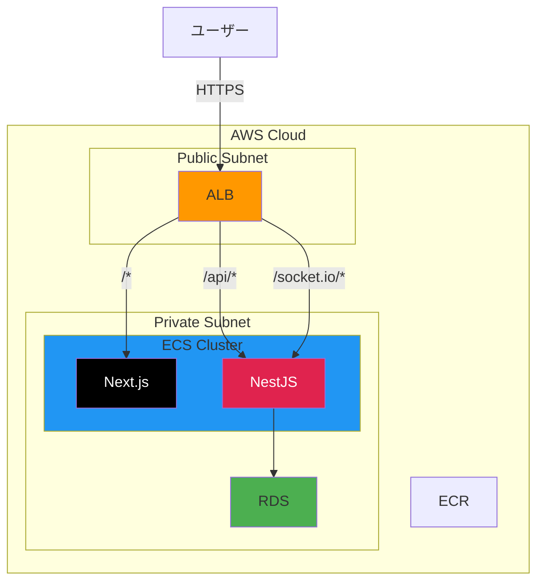

## 使用するサービス

| サービス | 役割 |
|----------|------|
| **ALB** | リクエストをパスで振り分け |
| **ECS** | Docker コンテナを実行 |
| **ECR** | Docker イメージを保存 |
| **RDS** | PostgreSQL データベース |
| **VPC** | ネットワーク（Public/Private 分離） |

## なぜこの構成？

**Q: Next.js は S3 + CloudFront じゃダメ？**

→ Next.js は SSR（サーバーサイドレンダリング）を使うので、サーバーが必要。
   静的ファイルだけの SPA（React など）なら S3 でOK。

**Q: なぜ2コンテナに分ける？**

→ フロントとバックを分けることで、個別にスケール・デプロイできる。

---

# Part 2: AWS サービス解説

## VPC（ネットワーク）

AWS 内に作るプライベートネットワーク。

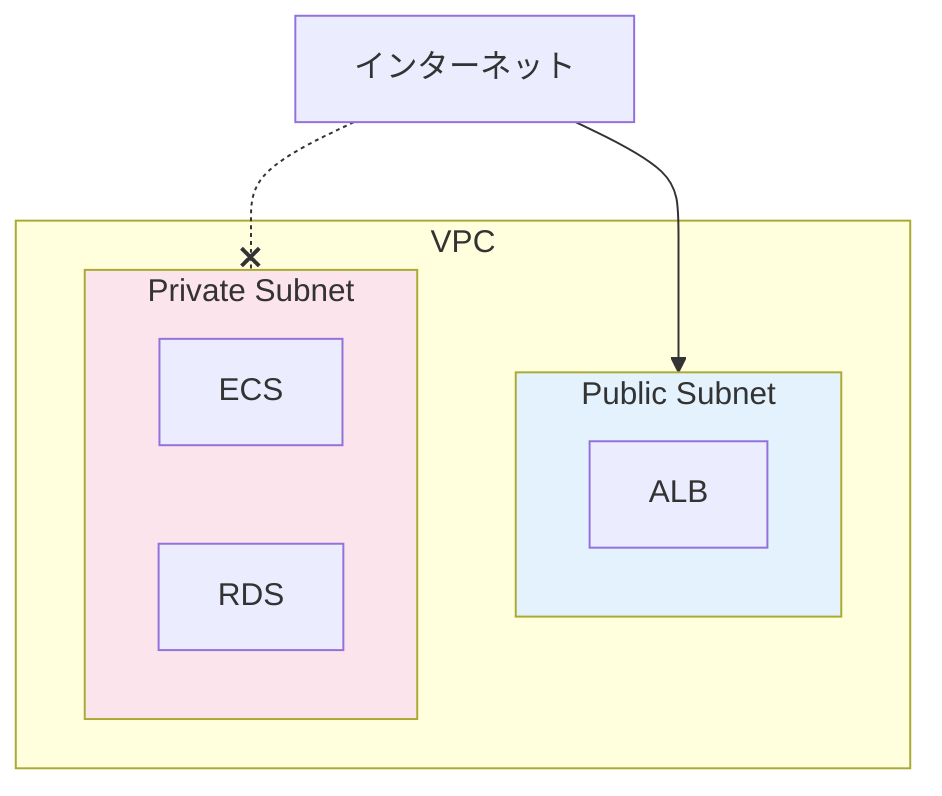

| Subnet | 役割 |
|--------|------|
| **Public** | インターネットからアクセス可能（ALB を配置） |
| **Private** | インターネットから直接アクセス不可（ECS, RDS を配置） |

→ RDS を Private に置くことで、外部から直接アクセスできないようにする（セキュリティ）

## ECS（コンテナ実行）

Docker コンテナを AWS 上で動かすサービス。

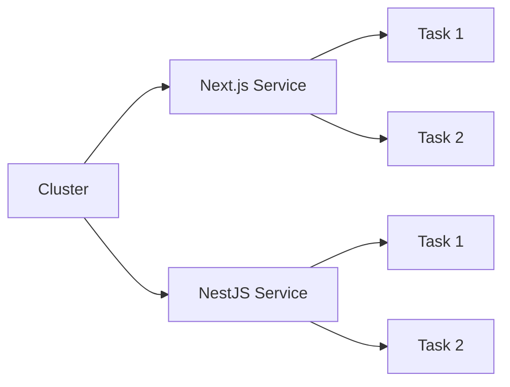

| 用語 | 説明 |
|------|------|
| **Cluster** | コンテナを動かすグループ |
| **Service** | 「何個動かすか」を管理 |
| **Task** | 実行中のコンテナ |

**Task が複数ある理由:**
- 負荷分散（リクエストを分散）
- 冗長化（1つ落ちても他が生きてる）
- ローリングデプロイ（片方ずつ更新）

### Fargate vs EC2

ECS でコンテナを動かす方式は2つ:

| 方式 | 特徴 |
|------|------|
| **Fargate** | サーバー管理不要、自動スケール、やや高い |
| **EC2** | サーバー管理必要、柔軟、最適化すれば安い |

→ Party Box なら **Fargate** がおすすめ（管理が楽）

## ALB（ロードバランサー）

リクエストを複数のコンテナに振り分ける。

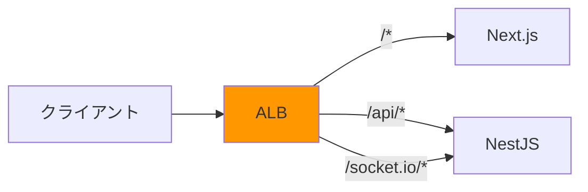

**機能:**
- パスベースルーティング（URL で振り分け先を変える）
- HTTPS 対応（SSL 終端）
- ヘルスチェック（死んだコンテナにはリクエストを送らない）
- WebSocket 対応

## RDS（データベース）

マネージド PostgreSQL。バックアップやパッチ適用を AWS が管理。

**機能:**
- 自動バックアップ
- Multi-AZ（複数拠点でレプリカ → 障害時も継続）
- セキュリティグループでアクセス制御

## ECR（コンテナレジストリ）

Docker イメージを保存する場所（Docker Hub の AWS 版）。

```bash
# イメージをビルドして ECR にプッシュ
docker build -t my-app .
docker tag my-app:latest <account>.dkr.ecr.<region>.amazonaws.com/my-app:latest
docker push <account>.dkr.ecr.<region>.amazonaws.com/my-app:latest
```

---

# Part 3: スケーリング

## Auto Scaling の仕組み

負荷に応じてコンテナを自動で増減できる。

**通常時:**
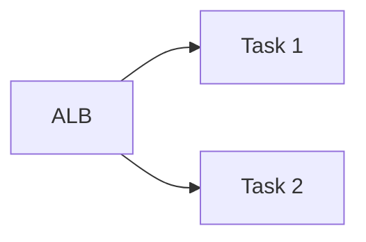

**負荷が高い時:**
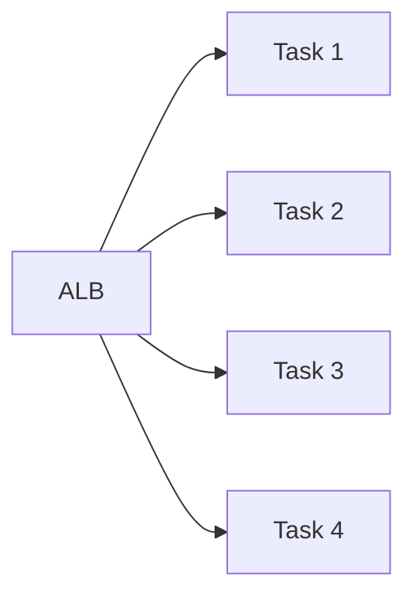

## 流れ

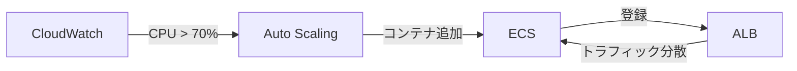

1. **CloudWatch** が CPU やリクエスト数を監視
2. 閾値を超えたら **Auto Scaling** が発動
3. **ECS** が新しい Task を起動
4. **ALB** が自動的に新しいコンテナにもトラフィックを流す
5. 負荷が下がったらコンテナを減らす

---

# Part 4: 発展

## S3 と CloudFront

Party Box では必須ではないが、よく使うので理解しておこう。

| サービス | 役割 |
|----------|------|
| **S3** | ファイル保存（画像、静的ファイル等） |
| **CloudFront** | CDN（世界中のエッジサーバーからキャッシュ配信） |

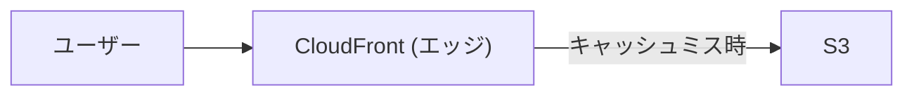

→ ユーザーに近いエッジサーバーから配信するので速い

## EC サイトのフル構成例

Party Box より複雑な本番構成の例:

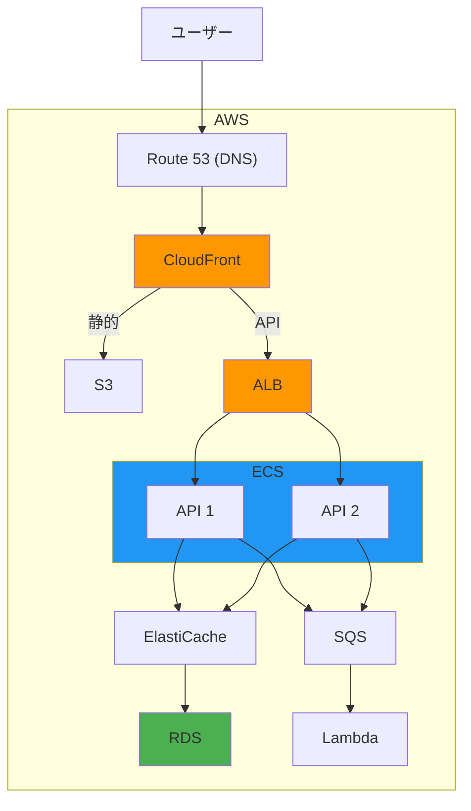

| サービス | 役割 |
|----------|------|
| **ElastiCache** | Redis キャッシュ（DB アクセス削減） |
| **SQS** | メッセージキュー（非同期処理） |
| **Lambda** | サーバーレス関数（画像リサイズ等） |
| **Secrets Manager** | パスワード・API キー管理 |
| **CloudWatch** | 監視・ログ・アラート |

## CI/CD パイプライン

コード変更 → 自動テスト → 自動デプロイの流れ。

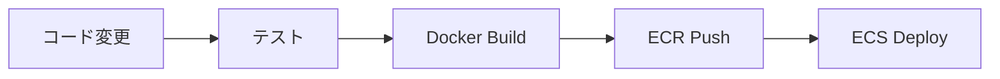

## インフラのコード化（IaC）

AWS リソースをコードで管理。手動でポチポチ作らない。

**Terraform の例:**
```hcl
resource "aws_ecs_cluster" "main" {
  name = "party-box-cluster"
}

resource "aws_ecs_service" "backend" {
  name            = "backend"
  cluster         = aws_ecs_cluster.main.id
  desired_count   = 2
  launch_type     = "FARGATE"
}
```

**メリット:**
- 環境の再現性（同じ構成を何度でも作れる）
- レビュー可能（PR でインフラ変更をレビュー）
- バージョン管理（変更履歴が残る）

---

# 課題

## 課題 1: AWS アカウント作成

1. AWS アカウントを作成
2. IAM ユーザーを作成（ルートユーザーは使わない）
3. MFA を有効化

## 課題 2: 構成図を書く

Party Box を本番運用する場合の AWS 構成図を自分で書いてみよう。

## 課題 3: 料金見積もり

[AWS Pricing Calculator](https://calculator.aws/) で Party Box の月額コストを見積もる。

---

# チェックリスト

- [ ] Party Box の技術スタック（Next.js + NestJS）を理解している
- [ ] AWS 構成図を説明できる
- [ ] VPC の Public/Private Subnet の違いを説明できる
- [ ] ECS の Cluster / Service / Task を説明できる
- [ ] ALB の役割（パスルーティング、負荷分散）を理解している
- [ ] Auto Scaling の仕組みを説明できる
- [ ] Fargate と EC2 の違いを説明できる

---

# 参考リソース

- [AWS 公式ドキュメント](https://docs.aws.amazon.com/)
- [AWS Well-Architected Framework](https://aws.amazon.com/architecture/well-architected/)
- [AWS Skill Builder](https://skillbuilder.aws/)
