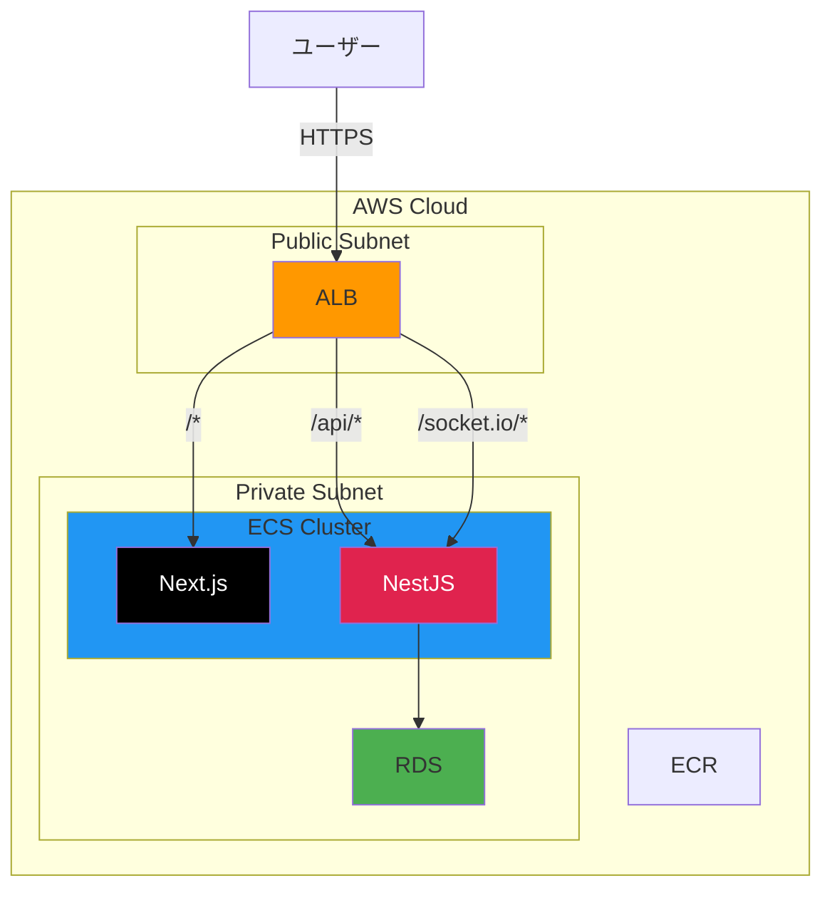

# 02. AWS 構成

## この章で学ぶこと

Party Box を AWS で本番運用するための構成を学ぶ。

## 目次

| ファイル | 内容 |
|----------|------|
| [02-aws-01-party-box.md](./02-aws-01-party-box.md) | Party Box の技術スタックと AWS 構成 |
| [02-aws-02-services.md](./02-aws-02-services.md) | AWS サービス解説（VPC, ECS, ALB, RDS, ECR） |
| [02-aws-http.md](./02-aws-http.md) | HTTP/HTTPS と SSL 証明書の仕組み |
| [02-aws-03-scaling.md](./02-aws-03-scaling.md) | スケーリングの仕組み |
| [02-aws-04-advanced.md](./02-aws-04-advanced.md) | 発展的な構成（EC サイトの例、CI/CD、IaC） |
| [02-aws-05-exercises.md](./02-aws-05-exercises.md) | 課題・チェックリスト・参考リソース |

## 全体像

## 使用するサービス一覧

| サービス | 役割 |
|----------|------|
| **ALB** | リクエストをパスで振り分け |
| **ECS** | Docker コンテナを実行 |
| **ECR** | Docker イメージを保存 |
| **RDS** | PostgreSQL データベース |
| **VPC** | ネットワーク（Public/Private 分離） |
