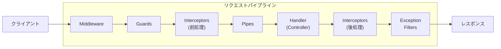

# 04. ミドルウェア

## 概要

ミドルウェアは、リクエストとレスポンスの間に挟まる処理。
NestJS では複数の種類があり、それぞれ異なる役割を持つ。

## なぜミドルウェアを学ぶのか

- 横断的関心事（認証、ログ、バリデーション）を一元管理
- コードの重複を防ぐ
- 関心の分離を実現
- セキュリティ対策に必須

---

## NestJS のリクエストパイプライン



実行順序:
1. **Middleware** - リクエストの前処理
2. **Guards** - 認証・認可
3. **Interceptors (前)** - ハンドラ実行前の処理
4. **Pipes** - バリデーション・変換
5. **Handler** - 実際のビジネスロジック
6. **Interceptors (後)** - ハンドラ実行後の処理
7. **Exception Filters** - エラーハンドリング

---

## 1. Middleware（ミドルウェア）

Express のミドルウェアと同じ。リクエスト/レスポンスを直接操作。

```typescript
@Injectable()
export class LoggerMiddleware implements NestMiddleware {
  use(req: Request, res: Response, next: NextFunction) {
    console.log(`[${new Date().toISOString()}] ${req.method} ${req.url}`);
    next(); // 次の処理へ
  }
}

// 適用
@Module({
  // ...
})
export class AppModule implements NestModule {
  configure(consumer: MiddlewareConsumer) {
    consumer
      .apply(LoggerMiddleware)
      .forRoutes('*'); // 全ルートに適用
  }
}
```

**ユースケース:**
- リクエストログ
- CORS 設定
- Cookie パース
- セッション管理

---

## 2. Guards（ガード）

認証・認可を担当。`true` を返せば通過、`false` や例外で拒否。

```typescript
@Injectable()
export class AuthGuard implements CanActivate {
  canActivate(context: ExecutionContext): boolean {
    const request = context.switchToHttp().getRequest();
    const token = request.headers.authorization;

    if (!token) {
      throw new UnauthorizedException('Token required');
    }

    // トークンを検証...
    return true;
  }
}

// コントローラーに適用
@Controller('users')
@UseGuards(AuthGuard)
export class UsersController {
  // 全メソッドで認証が必要
}

// 特定のメソッドのみ
@Controller('posts')
export class PostsController {
  @Get()
  findAll() {
    // 認証不要
  }

  @Post()
  @UseGuards(AuthGuard)
  create() {
    // 認証必要
  }
}
```

**ユースケース:**
- JWT 認証
- ロールベースアクセス制御
- API キー検証

### WebSocket での Guard

```typescript
@Injectable()
export class WsAuthGuard implements CanActivate {
  canActivate(context: ExecutionContext): boolean {
    const client = context.switchToWs().getClient();
    const data = context.switchToWs().getData();

    // WebSocket 接続の認証
    return this.validateConnection(client, data);
  }
}
```

---

## 3. Interceptors（インターセプター）

ハンドラの前後で処理を追加。レスポンスの変換やキャッシュに使う。

```typescript
@Injectable()
export class TransformInterceptor implements NestInterceptor {
  intercept(context: ExecutionContext, next: CallHandler): Observable<any> {
    console.log('Before handler...');

    return next.handle().pipe(
      tap(() => console.log('After handler...')),
      map(data => ({
        success: true,
        data,
        timestamp: new Date().toISOString(),
      })),
    );
  }
}

// 適用後のレスポンス
// { success: true, data: { ... }, timestamp: "2024-01-01T00:00:00.000Z" }
```

**よく使うパターン:**

### タイムアウト

```typescript
@Injectable()
export class TimeoutInterceptor implements NestInterceptor {
  intercept(context: ExecutionContext, next: CallHandler): Observable<any> {
    return next.handle().pipe(timeout(5000)); // 5秒でタイムアウト
  }
}
```

### キャッシュ

```typescript
@Injectable()
export class CacheInterceptor implements NestInterceptor {
  constructor(private cache: Map<string, any>) {}

  intercept(context: ExecutionContext, next: CallHandler): Observable<any> {
    const key = context.switchToHttp().getRequest().url;

    if (this.cache.has(key)) {
      return of(this.cache.get(key));
    }

    return next.handle().pipe(
      tap(data => this.cache.set(key, data)),
    );
  }
}
```

### ロギング

```typescript
@Injectable()
export class LoggingInterceptor implements NestInterceptor {
  intercept(context: ExecutionContext, next: CallHandler): Observable<any> {
    const now = Date.now();
    const request = context.switchToHttp().getRequest();

    return next.handle().pipe(
      tap(() => {
        console.log(`${request.method} ${request.url} - ${Date.now() - now}ms`);
      }),
    );
  }
}
```

---

## 4. Pipes（パイプ）

データのバリデーションと変換を担当。

### 組み込み Pipes

```typescript
@Controller('users')
export class UsersController {
  @Get(':id')
  findOne(
    @Param('id', ParseIntPipe) id: number, // 文字列 → 数値に変換
  ) {
    return this.usersService.findOne(id);
  }

  @Get()
  findAll(
    @Query('active', new DefaultValuePipe(true), ParseBoolPipe)
    active: boolean,
  ) {
    return this.usersService.findAll({ active });
  }
}
```

| Pipe | 用途 |
|------|------|
| `ParseIntPipe` | 文字列を整数に変換 |
| `ParseBoolPipe` | 文字列をbooleanに変換 |
| `ParseUUIDPipe` | UUIDの形式を検証 |
| `DefaultValuePipe` | デフォルト値を設定 |
| `ValidationPipe` | class-validator でバリデーション |

### ValidationPipe + class-validator

```typescript
// DTO
import { IsString, IsEmail, MinLength } from 'class-validator';

export class CreateUserDto {
  @IsString()
  @MinLength(2)
  name: string;

  @IsEmail()
  email: string;

  @IsString()
  @MinLength(8)
  password: string;
}

// グローバルに適用 (main.ts)
app.useGlobalPipes(new ValidationPipe({
  whitelist: true,      // DTOにないプロパティを除去
  forbidNonWhitelisted: true, // 未知のプロパティでエラー
  transform: true,      // 型変換を有効化
}));

// 使用
@Post()
create(@Body() dto: CreateUserDto) {
  // dto は自動的にバリデーション済み
}
```

---

## 5. Exception Filters（例外フィルター）

例外をキャッチしてカスタムレスポンスを返す。

```typescript
@Catch(HttpException)
export class HttpExceptionFilter implements ExceptionFilter {
  catch(exception: HttpException, host: ArgumentsHost) {
    const ctx = host.switchToHttp();
    const response = ctx.getResponse<Response>();
    const request = ctx.getRequest<Request>();
    const status = exception.getStatus();

    response.status(status).json({
      statusCode: status,
      timestamp: new Date().toISOString(),
      path: request.url,
      message: exception.message,
    });
  }
}

// グローバルに適用
app.useGlobalFilters(new HttpExceptionFilter());
```

### カスタム例外

```typescript
// game.errors.ts
export class RoomNotFoundError extends Error {
  constructor(roomId: string) {
    super(`Room ${roomId} not found`);
    this.name = 'RoomNotFoundError';
  }
}

// フィルターで処理
@Catch(RoomNotFoundError)
export class RoomNotFoundExceptionFilter implements ExceptionFilter {
  catch(exception: RoomNotFoundError, host: ArgumentsHost) {
    const ctx = host.switchToHttp();
    const response = ctx.getResponse<Response>();

    response.status(404).json({
      error: 'ROOM_NOT_FOUND',
      message: exception.message,
    });
  }
}
```

---

## Party Box での実装例

### エラーハンドリング (game.errors.ts)

```typescript
// カスタムエラークラス
export class GameError extends Error {
  constructor(
    public code: string,
    message: string,
  ) {
    super(message);
  }
}

export class RoomNotFoundError extends GameError {
  constructor(roomId: string) {
    super('ROOM_NOT_FOUND', `Room ${roomId} not found`);
  }
}

export class NotHostError extends GameError {
  constructor() {
    super('NOT_HOST', 'Only the host can perform this action');
  }
}
```

### Gateway でのエラーハンドリング

```typescript
@WebSocketGateway()
export class GameGateway {
  @SubscribeMessage('start-game')
  async handleStartGame(
    @MessageBody() data: StartGameDto,
    @ConnectedSocket() client: Socket,
  ) {
    try {
      const result = await this.startGameUseCase.execute(data);
      this.broadcastToRoom(data.roomId, 'game-started', result);
    } catch (error) {
      if (error instanceof GameError) {
        client.emit('error', {
          code: error.code,
          message: error.message,
        });
      } else {
        client.emit('error', {
          code: 'UNKNOWN_ERROR',
          message: 'An unexpected error occurred',
        });
      }
    }
  }
}
```

---

## 適用範囲の比較

| 要素 | メソッド | コントローラー | グローバル |
|------|----------|---------------|-----------|
| Guards | `@UseGuards()` | `@UseGuards()` | `app.useGlobalGuards()` |
| Interceptors | `@UseInterceptors()` | `@UseInterceptors()` | `app.useGlobalInterceptors()` |
| Pipes | パラメーター装飾 | `@UsePipes()` | `app.useGlobalPipes()` |
| Filters | `@UseFilters()` | `@UseFilters()` | `app.useGlobalFilters()` |

---

## ハンズオン課題

### 課題 1: バリデーション Pipe を実装

`SubmitHintDto` にバリデーションを追加:

```typescript
export class SubmitHintDto {
  @IsString()
  @IsNotEmpty()
  roomId: string;

  @IsString()
  @IsNotEmpty()
  playerId: string;

  @IsString()
  @MinLength(1)
  @MaxLength(50)
  hint: string;
}
```

### 課題 2: ログ Interceptor を作成

全てのリクエストの処理時間を記録する Interceptor を作成してみよう。

### 課題 3: エラーフィルターの追跡

`backend/src/application/error/game.errors.ts` を読んで、
どんなエラーケースが定義されているか一覧化しよう。

---

## 参考リソース

- [NestJS Middleware](https://docs.nestjs.com/middleware)
- [NestJS Guards](https://docs.nestjs.com/guards)
- [NestJS Interceptors](https://docs.nestjs.com/interceptors)
- [NestJS Pipes](https://docs.nestjs.com/pipes)
- [NestJS Exception Filters](https://docs.nestjs.com/exception-filters)

---

## チェックリスト

- [ ] リクエストパイプラインの実行順序を説明できる
- [ ] Middleware, Guard, Interceptor, Pipe, Filter の違いを説明できる
- [ ] ValidationPipe + class-validator の使い方を理解している
- [ ] カスタム例外とフィルターを作成できる
- [ ] 適切な場面で適切なミドルウェアを選択できる
