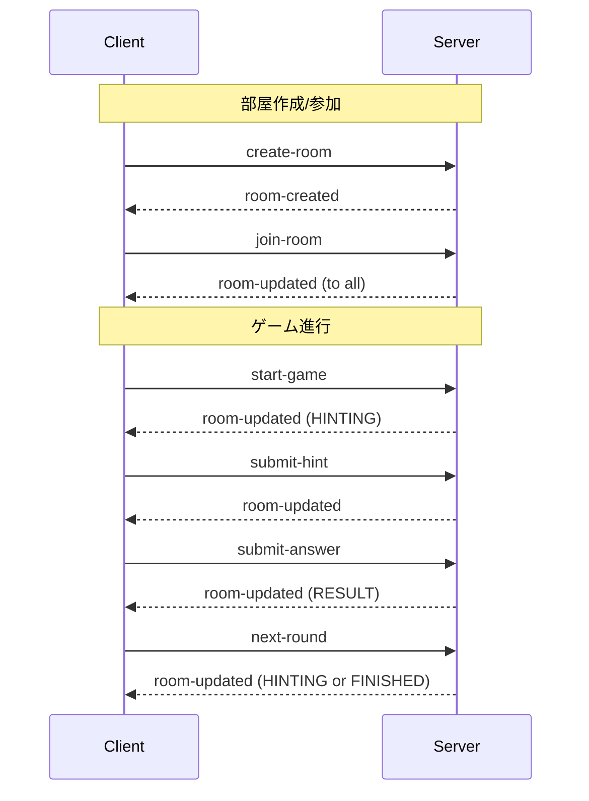

# 05. BFF と WebSocket

## 概要

BFF (Backend For Frontend) はフロントエンド専用のバックエンド層。
Party Box では WebSocket (Socket.io) を使ったリアルタイム通信がこの役割を担う。

## なぜ BFF と WebSocket を学ぶのか

- モダンな Web アプリに必須のリアルタイム通信
- フロントエンドに最適化された API 設計
- ゲームやチャットなど双方向通信が必要なアプリの基盤

---

## BFF (Backend For Frontend) とは

### 従来のアーキテクチャ

```
┌──────────────────────────────────────┐
│              Backend API              │
│  (汎用的な REST API)                  │
└──────────────────────────────────────┘
        ↑           ↑           ↑
        │           │           │
   ┌────┴───┐  ┌────┴───┐  ┌────┴───┐
   │ Web    │  │ Mobile │  │ Admin  │
   │ Client │  │ App    │  │ Panel  │
   └────────┘  └────────┘  └────────┘
```

**問題点:**
- 各クライアントが必要なデータが異なる
- 1画面に複数の API コールが必要
- 過剰なデータ取得（オーバーフェッチング）

### BFF パターン

```
┌──────────┐  ┌──────────┐  ┌──────────┐
│ Web BFF  │  │Mobile BFF│  │Admin BFF │
│(Next.js) │  │(専用API) │  │(専用API) │
└────┬─────┘  └────┬─────┘  └────┬─────┘
     │             │             │
     └─────────────┼─────────────┘
                   │
       ┌───────────┴───────────┐
       │   Core Backend API    │
       │   (ドメインロジック)  │
       └───────────────────────┘
```

**メリット:**
- 各クライアントに最適化されたレスポンス
- フロントエンド開発者が API を制御
- 関心の分離

### Party Box における BFF

```
┌─────────────────────────────────────────┐
│           WebSocket Gateway             │
│  (フロントエンド専用のリアルタイムAPI)  │
├─────────────────────────────────────────┤
│  - プレイヤーごとにビュー変換           │
│  - 回答者にはお題を隠す                 │
│  - 接続状態管理                         │
└─────────────────────────────────────────┘
                    ↑
                    │ WebSocket
                    │
            ┌───────┴───────┐
            │   Frontend    │
            │  (Next.js)    │
            └───────────────┘
```

Party Box の Gateway は:
- 各プレイヤーに適切な情報だけを送る
- リアルタイムでゲーム状態を同期
- 接続/切断を管理

---

## HTTP vs WebSocket

### HTTP (REST API)

```
クライアント                  サーバー
    │                           │
    │──── Request ─────────────>│
    │<─── Response ─────────────│
    │                           │
    │──── Request ─────────────>│
    │<─── Response ─────────────│
```

- リクエスト/レスポンス型
- ステートレス
- 毎回接続を確立

### WebSocket

```
クライアント                  サーバー
    │                           │
    │─── Handshake ────────────>│
    │<── Connection Upgrade ────│
    │                           │
    │<=== 双方向通信 ===========>│
    │                           │
    │<─── Server Push ──────────│
    │                           │
    │──── Client Message ──────>│
```

- 常時接続
- 双方向通信
- 低レイテンシ
- サーバープッシュ可能

---

## Socket.io の基本

### なぜ Socket.io か

| 機能 | WebSocket API | Socket.io |
|------|--------------|-----------|
| 自動再接続 | × | ○ |
| フォールバック | × | ○ (HTTP Polling) |
| ルーム機能 | × | ○ |
| 名前空間 | × | ○ |
| ブロードキャスト | × | ○ |

### サーバー側 (NestJS)

```typescript
@WebSocketGateway({
  cors: {
    origin: '*',
  },
})
export class GameGateway implements OnGatewayConnection, OnGatewayDisconnect {
  @WebSocketServer()
  server: Server;

  // 接続時
  handleConnection(client: Socket) {
    console.log(`Client connected: ${client.id}`);
  }

  // 切断時
  handleDisconnect(client: Socket) {
    console.log(`Client disconnected: ${client.id}`);
  }

  // イベント受信
  @SubscribeMessage('create-room')
  async handleCreateRoom(
    @MessageBody() data: CreateRoomDto,
    @ConnectedSocket() client: Socket,
  ) {
    // 処理...
    client.join(data.roomId); // ルームに参加
    return { roomId: data.roomId };
  }

  // ルームにブロードキャスト
  broadcastToRoom(roomId: string, event: string, data: any) {
    this.server.to(roomId).emit(event, data);
  }
}
```

### クライアント側 (React)

```typescript
import { io, Socket } from 'socket.io-client';

// 接続
const socket: Socket = io('http://localhost:3001');

// イベント送信
socket.emit('create-room', {
  playerName: 'Player1',
  settings: { totalRounds: 3 },
});

// イベント受信
socket.on('room-updated', (data) => {
  console.log('Room state:', data);
});

// 切断
socket.disconnect();
```

---

## Party Box の WebSocket 設計

### イベント一覧



### イベント詳細

| イベント (C→S) | 用途 | パラメーター |
|----------------|------|-------------|
| `create-room` | 部屋作成 | playerName, settings |
| `join-room` | 部屋参加 | roomId, playerName |
| `start-game` | ゲーム開始 | roomId, playerId |
| `submit-hint` | ヒント提出 | roomId, playerId, hint |
| `submit-answer` | 回答提出 | roomId, playerId, answer |
| `next-round` | 次ラウンド | roomId, playerId |
| `regenerate-topic` | お題再生成 | roomId, playerId |

| イベント (S→C) | 用途 | データ |
|----------------|------|--------|
| `room-created` | 部屋作成完了 | roomId, playerId |
| `room-updated` | 状態更新 | RoomState (プレイヤービュー) |
| `error` | エラー | code, message |

### プレイヤービューの変換

```typescript
// 全プレイヤーに同じデータを送らない！
broadcastRoomUpdate(room: Room) {
  for (const player of room.players) {
    const playerView = this.createPlayerView(room, player.id);
    this.server.to(player.socketId).emit('room-updated', playerView);
  }
}

createPlayerView(room: Room, playerId: string): RoomState {
  const game = room.game;
  const isGuesser = game?.currentGuesser?.id === playerId;

  return {
    ...room.toState(),
    game: game ? {
      ...game.toState(),
      // 回答者にはお題を隠す
      topic: isGuesser ? '???' : game.topic,
    } : null,
  };
}
```

---

## ルーム機能

Socket.io の強力な機能。特定のグループにだけメッセージを送れる。

```typescript
// ルームに参加
client.join('room-abc123');

// ルームから退出
client.leave('room-abc123');

// ルームにブロードキャスト（自分以外）
client.to('room-abc123').emit('user-joined', { name: 'Player1' });

// ルーム全員に送信（自分含む）
this.server.to('room-abc123').emit('room-updated', data);

// 複数ルームに送信
this.server.to('room-1').to('room-2').emit('announcement', data);
```

---

## useSocket フック (Frontend)

```typescript
// hooks/useSocket.ts
export function useSocket() {
  const [isConnected, setIsConnected] = useState(false);
  const [roomState, setRoomState] = useState<RoomState | null>(null);
  const [error, setError] = useState<string | null>(null);

  useEffect(() => {
    const socket = getSocket();

    socket.on('connect', () => setIsConnected(true));
    socket.on('disconnect', () => setIsConnected(false));
    socket.on('room-updated', (data) => setRoomState(data));
    socket.on('error', (data) => setError(data.message));

    return () => {
      socket.off('connect');
      socket.off('disconnect');
      socket.off('room-updated');
      socket.off('error');
    };
  }, []);

  const createRoom = (playerName: string, settings: GameSettings) => {
    const socket = getSocket();
    socket.emit('create-room', { playerName, settings });
  };

  // 他のアクション...

  return {
    isConnected,
    roomState,
    error,
    createRoom,
    // ...
  };
}
```

---

## エラーハンドリング

### サーバー側

```typescript
@SubscribeMessage('submit-hint')
async handleSubmitHint(
  @MessageBody() data: SubmitHintDto,
  @ConnectedSocket() client: Socket,
) {
  try {
    const result = await this.submitHintUseCase.execute(data);
    this.broadcastRoomUpdate(result.room);
  } catch (error) {
    // 特定のクライアントにエラーを送信
    client.emit('error', {
      code: error instanceof GameError ? error.code : 'UNKNOWN',
      message: error.message,
    });
  }
}
```

### クライアント側

```typescript
useEffect(() => {
  socket.on('error', (data) => {
    toast.error(data.message);
    setError(data.message);
  });
}, []);
```

---

## 接続状態の管理

```typescript
@WebSocketGateway()
export class GameGateway implements OnGatewayDisconnect {
  handleDisconnect(client: Socket) {
    // プレイヤーの接続状態を更新
    const player = this.findPlayerBySocketId(client.id);
    if (player) {
      player.isConnected = false;
      this.broadcastRoomUpdate(player.room);
    }
  }
}
```

---

## ハンズオン課題

### 課題 1: イベントフローを追跡

`backend/src/presentation/gateway/game.gateway.ts` を読んで:
1. 定義されている全イベントを一覧化
2. 各イベントがどの UseCase を呼んでいるか図示

### 課題 2: フロントエンドのフックを読む

`frontend/src/hooks/useSocket.ts` を読んで:
1. どんな状態を管理しているか
2. どんなアクションを提供しているか

### 課題 3: 新しいイベントを追加

「タイピング中」を通知するイベントを追加してみよう:

```typescript
// Server
@SubscribeMessage('typing')
handleTyping(@MessageBody() data: { roomId: string; playerId: string }) {
  this.server.to(data.roomId).emit('player-typing', { playerId: data.playerId });
}

// Client
socket.emit('typing', { roomId, playerId });
socket.on('player-typing', (data) => {
  console.log(`${data.playerId} is typing...`);
});
```

---

## 参考リソース

- [Socket.io 公式ドキュメント](https://socket.io/docs/v4/)
- [NestJS WebSockets](https://docs.nestjs.com/websockets/gateways)
- [BFF パターン (Sam Newman)](https://samnewman.io/patterns/architectural/bff/)

---

## チェックリスト

- [ ] BFF パターンの目的を説明できる
- [ ] HTTP と WebSocket の違いを説明できる
- [ ] Socket.io のルーム機能を理解している
- [ ] NestJS Gateway の基本的な書き方を理解している
- [ ] クライアント側での接続管理を理解している
