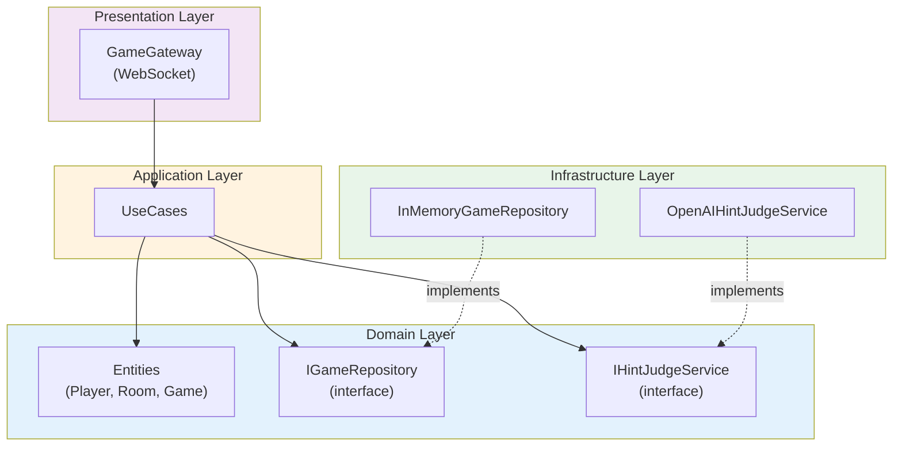

# 07. クリーンアーキテクチャ

## 概要

クリーンアーキテクチャは Robert C. Martin (Uncle Bob) が提唱した設計思想。
ビジネスロジックを外部依存から切り離し、テスト容易性と保守性を高める。

## なぜクリーンアーキテクチャを学ぶのか

- フレームワークに依存しないコードが書ける
- テストしやすい設計になる
- 変更に強いアプリケーションを作れる
- ドメイン知識がコードに表現される

---

## 基本原則

### 依存性のルール

**内側の層は外側の層を知らない**

```
┌──────────────────────────────────────────────────────┐
│                  Frameworks & Drivers                 │
│  ┌────────────────────────────────────────────────┐  │
│  │              Interface Adapters                │  │
│  │  ┌──────────────────────────────────────────┐  │  │
│  │  │          Application Business Rules      │  │  │
│  │  │  ┌────────────────────────────────────┐  │  │  │
│  │  │  │    Enterprise Business Rules       │  │  │  │
│  │  │  │          (Entities)                │  │  │  │
│  │  │  └────────────────────────────────────┘  │  │  │
│  │  └──────────────────────────────────────────┘  │  │
│  └────────────────────────────────────────────────┘  │
└──────────────────────────────────────────────────────┘

依存の方向: 外側 → 内側
```

| 層 | 役割 | Party Box での実装 |
|----|------|-------------------|
| Enterprise Business Rules | ビジネスルール（エンティティ） | `domain/model/` |
| Application Business Rules | ユースケース | `application/usecase/` |
| Interface Adapters | 変換層（Controller, Gateway, Repository） | `presentation/`, `infrastructure/` |
| Frameworks & Drivers | フレームワーク、DB、外部API | NestJS, Socket.io, OpenAI |

---

## Party Box の4層構造

```
backend/src/
├── domain/           # ドメイン層（最も内側）
├── application/      # アプリケーション層
├── infrastructure/   # インフラストラクチャ層
└── presentation/     # プレゼンテーション層（最も外側）
```



---

## 1. Domain Layer（ドメイン層）

ビジネスロジックの中核。フレームワーク非依存の純粋な TypeScript。

```
domain/
├── model/
│   ├── player.ts           # Player エンティティ
│   ├── room.ts             # Room エンティティ
│   └── games/
│       └── just-one/
│           └── just-one.game.ts  # JustOne ゲームロジック
├── repository/
│   └── i-game.repository.ts  # リポジトリインターフェース
└── service/
    └── i-hint-judge.service.ts  # 外部サービスインターフェース
```

### エンティティ

ビジネスルールをカプセル化したオブジェクト。

```typescript
// domain/model/player.ts
export class Player {
  constructor(
    public readonly id: string,
    public readonly name: string,
    public isHost: boolean,
    public isConnected: boolean,
  ) {}

  static create(name: string, isHost: boolean = false): Player {
    return new Player(uuid(), name, isHost, true);
  }

  disconnect(): void {
    this.isConnected = false;
  }

  reconnect(): void {
    this.isConnected = true;
  }
}
```

```typescript
// domain/model/games/just-one/just-one.game.ts
export class JustOneGame {
  private phase: GamePhase = 'HINTING';
  private hints: Map<string, Hint> = new Map();
  private score: number = 0;

  constructor(
    private players: Player[],
    private topic: string,
    private currentGuesser: Player,
    private totalRounds: number,
  ) {}

  // ビジネスルール: ヒント提出
  submitHint(playerId: string, hint: string): void {
    if (this.phase !== 'HINTING') {
      throw new Error('Cannot submit hint in this phase');
    }
    if (playerId === this.currentGuesser.id) {
      throw new Error('Guesser cannot submit hint');
    }
    if (this.hints.has(playerId)) {
      throw new Error('Already submitted hint');
    }

    this.hints.set(playerId, { playerId, text: hint, status: 'pending' });
  }

  // ビジネスルール: 全員提出完了かチェック
  areAllHintsSubmitted(): boolean {
    const hinterCount = this.players.length - 1; // 回答者を除く
    return this.hints.size === hinterCount;
  }

  // 状態遷移
  transitionToGuessing(judgedHints: HintJudgmentResult[]): void {
    if (this.phase !== 'HINTING') {
      throw new Error('Invalid phase transition');
    }

    // 判定結果を反映
    for (const result of judgedHints) {
      const hint = this.hints.get(result.playerId);
      if (hint) {
        hint.status = result.isDuplicate ? 'duplicate' : 'valid';
      }
    }

    this.phase = 'GUESSING';
  }
}
```

### インターフェース（依存性逆転）

ドメイン層でインターフェースを定義し、実装は外側の層に任せる。

```typescript
// domain/repository/i-game.repository.ts
export interface IGameRepository {
  saveRoom(room: Room): Promise<void>;
  findRoomById(roomId: string): Promise<Room | null>;
  deleteRoom(roomId: string): Promise<void>;
  roomExists(roomId: string): Promise<boolean>;
}

// domain/service/i-hint-judge.service.ts
export interface IHintJudgeService {
  generateTopic(excludeTopics?: string[]): Promise<string>;
  validateHintFormat(hint: string): Promise<HintFormatValidation>;
  judgeHints(topic: string, hints: Hint[]): Promise<HintJudgmentResult[]>;
  judgeAnswer(topic: string, answer: string): Promise<AnswerJudgment>;
}
```

---

## 2. Application Layer（アプリケーション層）

ユースケースを実装。ドメインオブジェクトを調整してビジネスフローを実現。

```
application/
├── usecase/
│   ├── create-room.usecase.ts
│   ├── join-room.usecase.ts
│   ├── start-game.usecase.ts
│   ├── submit-hint.usecase.ts
│   ├── submit-answer.usecase.ts
│   └── next-round.usecase.ts
├── dto/
│   └── game-action.dto.ts
└── error/
    └── game.errors.ts
```

### UseCase パターン

```typescript
// application/usecase/submit-hint.usecase.ts
@Injectable()
export class SubmitHintUseCase {
  constructor(
    @Inject('IGameRepository')
    private repository: IGameRepository,
    @Inject('IHintJudgeService')
    private hintJudge: IHintJudgeService,
  ) {}

  async execute(dto: SubmitHintDto): Promise<SubmitHintResult> {
    // 1. リポジトリからルームを取得
    const room = await this.repository.findRoomById(dto.roomId);
    if (!room) {
      throw new RoomNotFoundError(dto.roomId);
    }

    const game = room.game;
    if (!game) {
      throw new GameNotStartedError();
    }

    // 2. ヒントのフォーマット検証（外部サービス）
    const formatValidation = await this.hintJudge.validateHintFormat(dto.hint);
    if (!formatValidation.isValid) {
      throw new InvalidHintFormatError(formatValidation.reason);
    }

    // 3. ドメインロジック実行
    game.submitHint(dto.playerId, dto.hint);

    // 4. 全員提出完了なら重複判定
    if (game.areAllHintsSubmitted()) {
      const hints = game.getAllHints();
      const judgedHints = await this.hintJudge.judgeHints(game.topic, hints);
      game.transitionToGuessing(judgedHints);
    }

    // 5. 保存
    await this.repository.saveRoom(room);

    return { room };
  }
}
```

### DTO (Data Transfer Object)

層間のデータ受け渡し用。

```typescript
// application/dto/game-action.dto.ts
export class SubmitHintDto {
  roomId: string;
  playerId: string;
  hint: string;
}

export interface SubmitHintResult {
  room: Room;
}
```

### カスタムエラー

```typescript
// application/error/game.errors.ts
export class RoomNotFoundError extends Error {
  constructor(roomId: string) {
    super(`Room ${roomId} not found`);
    this.name = 'RoomNotFoundError';
  }
}

export class InvalidHintFormatError extends Error {
  constructor(reason: string) {
    super(`Invalid hint format: ${reason}`);
    this.name = 'InvalidHintFormatError';
  }
}
```

---

## 3. Infrastructure Layer（インフラ層）

外部サービスとの接続。ドメインのインターフェースを実装。

```
infrastructure/
├── repository/
│   └── in-memory-game.repository.ts
├── service/
│   ├── openai-hint-judge.service.ts
│   └── prompts/
│       └── just-one.prompts.ts
└── module/
    ├── app.module.ts
    └── game.module.ts
```

### リポジトリ実装

```typescript
// infrastructure/repository/in-memory-game.repository.ts
@Injectable()
export class InMemoryGameRepository implements IGameRepository {
  private rooms = new Map<string, Room>();

  async saveRoom(room: Room): Promise<void> {
    this.rooms.set(room.id, room);
  }

  async findRoomById(roomId: string): Promise<Room | null> {
    return this.rooms.get(roomId) || null;
  }

  async deleteRoom(roomId: string): Promise<void> {
    this.rooms.delete(roomId);
  }

  async roomExists(roomId: string): Promise<boolean> {
    return this.rooms.has(roomId);
  }
}
```

### 外部サービス実装

```typescript
// infrastructure/service/openai-hint-judge.service.ts
@Injectable()
export class OpenAIHintJudgeService implements IHintJudgeService {
  private client: OpenAI;

  constructor() {
    this.client = new OpenAI({ apiKey: process.env.OPENAI_API_KEY });
  }

  async generateTopic(excludeTopics: string[] = []): Promise<string> {
    const response = await this.client.chat.completions.create({
      model: 'gpt-4.1-mini',
      messages: [
        { role: 'system', content: SYSTEM_PROMPTS.GENERATE_TOPIC },
        { role: 'user', content: USER_PROMPTS.generateTopic(excludeTopics) },
      ],
    });

    return response.choices[0].message.content.trim();
  }

  // 他のメソッド...
}
```

---

## 4. Presentation Layer（プレゼンテーション層）

外部からのリクエストを受け付け、UseCase に委譲。

```typescript
// presentation/gateway/game.gateway.ts
@WebSocketGateway()
export class GameGateway {
  constructor(
    private createRoomUseCase: CreateRoomUseCase,
    private joinRoomUseCase: JoinRoomUseCase,
    private submitHintUseCase: SubmitHintUseCase,
    // ...
  ) {}

  @SubscribeMessage('submit-hint')
  async handleSubmitHint(
    @MessageBody() data: SubmitHintDto,
    @ConnectedSocket() client: Socket,
  ) {
    try {
      const result = await this.submitHintUseCase.execute(data);
      this.broadcastRoomUpdate(result.room);
    } catch (error) {
      client.emit('error', { message: error.message });
    }
  }
}
```

---

## 依存性逆転の原則 (DIP)

「高レベルモジュールは低レベルモジュールに依存すべきでない。
両方とも抽象に依存すべきである。」

### Before (依存性逆転なし)

```typescript
// UseCase が具体的な実装に依存
class SubmitHintUseCase {
  private repository = new InMemoryGameRepository(); // 直接依存
  private openai = new OpenAIHintJudgeService();     // 直接依存
}
```

問題点:
- DB を PostgreSQL に変えるとき UseCase を修正が必要
- テスト時にモックできない

### After (依存性逆転あり)

```typescript
// UseCase はインターフェースに依存
class SubmitHintUseCase {
  constructor(
    @Inject('IGameRepository')
    private repository: IGameRepository,  // インターフェースに依存
    @Inject('IHintJudgeService')
    private hintJudge: IHintJudgeService, // インターフェースに依存
  ) {}
}

// DI コンテナで実装をバインド
{
  provide: 'IGameRepository',
  useClass: InMemoryGameRepository, // 本番用
  // useClass: PostgresGameRepository, // ← 変更はここだけ
}
```

---

## テスト容易性

### UseCase のユニットテスト

```typescript
describe('SubmitHintUseCase', () => {
  let useCase: SubmitHintUseCase;
  let mockRepository: jest.Mocked<IGameRepository>;
  let mockHintJudge: jest.Mocked<IHintJudgeService>;

  beforeEach(() => {
    // モックを注入
    mockRepository = {
      findRoomById: jest.fn(),
      saveRoom: jest.fn(),
    };
    mockHintJudge = {
      validateHintFormat: jest.fn(),
      judgeHints: jest.fn(),
    };

    useCase = new SubmitHintUseCase(mockRepository, mockHintJudge);
  });

  it('should submit hint successfully', async () => {
    // Arrange
    const room = createTestRoom();
    mockRepository.findRoomById.mockResolvedValue(room);
    mockHintJudge.validateHintFormat.mockResolvedValue({ isValid: true });

    // Act
    await useCase.execute({ roomId: 'room-1', playerId: 'player-1', hint: 'test' });

    // Assert
    expect(mockRepository.saveRoom).toHaveBeenCalledWith(room);
  });
});
```

---

## ハンズオン課題

### 課題 1: 層を追跡

`backend/src/` の各ディレクトリを見て:
1. どの層に属するか分類
2. 依存関係が「外→内」になっているか確認

### 課題 2: UseCase を読む

`submit-hint.usecase.ts` を読んで:
1. どのドメインオブジェクトを使っているか
2. どの外部サービスを使っているか
3. エラーケースは何か

### 課題 3: 新しいリポジトリを設計

PostgreSQL 用のリポジトリを設計してみよう:

```typescript
// 何を変えれば PostgreSQL に移行できるか考える
@Injectable()
class PostgresGameRepository implements IGameRepository {
  constructor(private prisma: PrismaClient) {}

  async saveRoom(room: Room): Promise<void> {
    // Prisma で保存
  }
}
```

---

## 参考リソース

- [Clean Architecture (Robert C. Martin)](https://blog.cleancoder.com/uncle-bob/2012/08/13/the-clean-architecture.html)
- [書籍: Clean Architecture](https://www.amazon.co.jp/dp/4048930656)
- [SOLID 原則](https://en.wikipedia.org/wiki/SOLID)

---

## チェックリスト

- [ ] 4層構造とそれぞれの責務を説明できる
- [ ] 依存性のルール「外→内」を理解している
- [ ] 依存性逆転の原則 (DIP) を説明できる
- [ ] インターフェースを使った疎結合の利点を理解している
- [ ] クリーンアーキテクチャがテスト容易性を高める理由を説明できる
