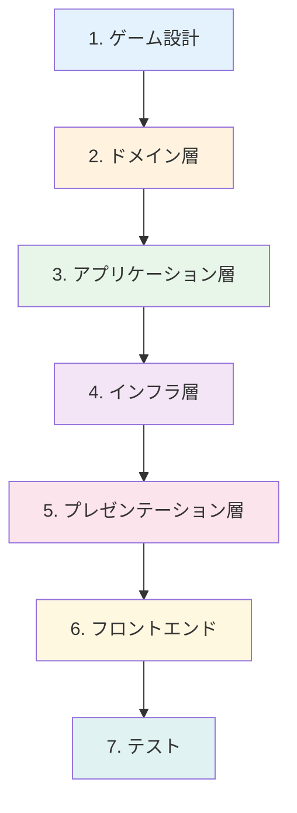

# 11. 実践編: 新しいゲームの追加

## 概要

このカリキュラムで学んだ知識を総動員して、Party Box に新しいゲームを追加する。
クリーンアーキテクチャに沿った実装を通じて理解を深める。

---

## ゲーム追加のステップ



---

## 1. ゲーム設計

まず、追加するゲームのルールと状態遷移を設計する。

### 例: ワードウルフ

**ルール:**

- 全員にお題が配られるが、1人だけ違うお題（ウルフ）
- 会話を通じて誰がウルフか推理
- 投票で最多得票者がアウト

**フェーズ:**

```
DISCUSSING → VOTING → RESULT → FINISHED
```

**状態:**

```typescript
interface WordWolfGame {
  type: "word-wolf";
  phase: "DISCUSSING" | "VOTING" | "RESULT" | "FINISHED";
  majorityWord: string; // 多数派のお題
  minorityWord: string; // 少数派（ウルフ）のお題
  wolfId: string; // ウルフのプレイヤーID
  votes: Map<string, string>; // 投票: voterId → targetId
  eliminatedId: string | null;
  wolfWins: boolean | null;
}
```

---

## 2. ドメイン層にゲームモデルを追加

`backend/src/domain/model/games/word-wolf/word-wolf.game.ts`:

```typescript
export type WordWolfPhase = "DISCUSSING" | "VOTING" | "RESULT" | "FINISHED";

export interface Vote {
  voterId: string;
  targetId: string;
}

export interface WordWolfState {
  type: "word-wolf";
  phase: WordWolfPhase;
  majorityWord: string;
  minorityWord: string;
  wolfId: string;
  votes: Vote[];
  eliminatedId: string | null;
  wolfWins: boolean | null;
  discussionEndTime: Date | null;
}

// ファクトリ関数
export function createWordWolfGame(
  players: Player[],
  majorityWord: string,
  minorityWord: string,
): WordWolfState {
  // ランダムにウルフを選出
  const wolfIndex = Math.floor(Math.random() * players.length);
  const wolfId = players[wolfIndex].id;

  return {
    type: "word-wolf",
    phase: "DISCUSSING",
    majorityWord,
    minorityWord,
    wolfId,
    votes: [],
    eliminatedId: null,
    wolfWins: null,
    discussionEndTime: null,
  };
}

// 投票を追加
export function submitVote(
  game: WordWolfState,
  voterId: string,
  targetId: string,
): WordWolfState {
  if (game.phase !== "VOTING") {
    throw new Error("Cannot vote in this phase");
  }

  // 既に投票済みかチェック
  if (game.votes.some((v) => v.voterId === voterId)) {
    throw new Error("Already voted");
  }

  return {
    ...game,
    votes: [...game.votes, { voterId, targetId }],
  };
}

// 投票結果を集計
export function tallyVotes(game: WordWolfState): WordWolfState {
  const voteCounts = new Map<string, number>();

  for (const vote of game.votes) {
    const count = voteCounts.get(vote.targetId) || 0;
    voteCounts.set(vote.targetId, count + 1);
  }

  // 最多得票者を特定
  let maxVotes = 0;
  let eliminatedId: string | null = null;

  for (const [playerId, count] of voteCounts) {
    if (count > maxVotes) {
      maxVotes = count;
      eliminatedId = playerId;
    }
  }

  // ウルフが追放されたか判定
  const wolfWins = eliminatedId !== game.wolfId;

  return {
    ...game,
    phase: "RESULT",
    eliminatedId,
    wolfWins,
  };
}

// フェーズ遷移
export function transitionToVoting(game: WordWolfState): WordWolfState {
  if (game.phase !== "DISCUSSING") {
    throw new Error("Invalid phase transition");
  }

  return {
    ...game,
    phase: "VOTING",
  };
}

// 型ガード
export function isWordWolf(game: unknown): game is WordWolfState {
  return (game as WordWolfState)?.type === "word-wolf";
}
```

### ゲーム型の追加

`backend/src/domain/model/game-base.ts`:

```typescript
export type GameType = "just-one" | "word-wolf";

export const GAME_CONFIGS: Record<GameType, GameConfig> = {
  "just-one": { minPlayers: 3, maxPlayers: 10 },
  "word-wolf": { minPlayers: 4, maxPlayers: 8 },
};
```

---

## 3. アプリケーション層にユースケースを追加

`backend/src/application/usecase/word-wolf/`:

```
word-wolf/
├── start-word-wolf.usecase.ts
├── start-voting.usecase.ts
├── submit-vote.usecase.ts
└── end-game.usecase.ts
```

### 例: submit-vote.usecase.ts

```typescript
import { Inject, Injectable } from "@nestjs/common";
import { IGameRepository } from "../../../domain/repository/i-game.repository";
import {
  submitVote,
  tallyVotes,
  isWordWolf,
} from "../../../domain/model/games/word-wolf/word-wolf.game";
import {
  RoomNotFoundError,
  InvalidGameTypeError,
} from "../../error/game.errors";

interface SubmitVoteDto {
  roomId: string;
  playerId: string;
  targetId: string;
}

@Injectable()
export class SubmitVoteUseCase {
  constructor(
    @Inject("IGameRepository")
    private repository: IGameRepository,
  ) {}

  async execute(dto: SubmitVoteDto): Promise<Room> {
    // 1. ルームを取得
    const room = await this.repository.findRoomById(dto.roomId);
    if (!room) {
      throw new RoomNotFoundError(dto.roomId);
    }

    // 2. ゲームタイプを検証
    if (!room.game || !isWordWolf(room.game)) {
      throw new InvalidGameTypeError("word-wolf");
    }

    // 3. 投票を追加
    room.game = submitVote(room.game, dto.playerId, dto.targetId);

    // 4. 全員投票完了なら集計
    const totalPlayers = room.players.length;
    if (room.game.votes.length === totalPlayers) {
      room.game = tallyVotes(room.game);
    }

    // 5. 保存
    await this.repository.saveRoom(room);

    return room;
  }
}
```

---

## 4. インフラ層: AI サービスの拡張（必要に応じて）

ワードウルフではお題の生成に AI を使う。

`backend/src/domain/service/i-word-generator.service.ts`:

```typescript
export interface WordPair {
  majority: string;
  minority: string;
}

export interface IWordGeneratorService {
  generateWordPair(category?: string): Promise<WordPair>;
}
```

`backend/src/infrastructure/service/openai-word-generator.service.ts`:

```typescript
@Injectable()
export class OpenAIWordGeneratorService implements IWordGeneratorService {
  constructor(private openai: OpenAI) {}

  async generateWordPair(category?: string): Promise<WordPair> {
    const response = await this.openai.chat.completions.create({
      model: "gpt-4.1-mini",
      messages: [
        {
          role: "system",
          content: `似ているが微妙に違う2つの単語のペアを生成してください。
                    形式: majority,minority
                    例: りんご,みかん`,
        },
        {
          role: "user",
          content: category
            ? `カテゴリ: ${category} から生成`
            : "ランダムなカテゴリから生成",
        },
      ],
    });

    const [majority, minority] = response.choices[0].message.content.split(",");
    return { majority: majority.trim(), minority: minority.trim() };
  }
}
```

---

## 5. プレゼンテーション層: Gateway にイベントを追加

`backend/src/presentation/gateway/game.gateway.ts`:

```typescript
// 新しいイベントハンドラを追加

@SubscribeMessage('start-word-wolf')
async handleStartWordWolf(
  @ConnectedSocket() client: Socket,
  @MessageBody() data: StartWordWolfDto,
) {
  try {
    const room = await this.startWordWolfUseCase.execute(data);
    this.broadcastRoomState(room);
  } catch (error) {
    this.handleError(client, error);
  }
}

@SubscribeMessage('submit-vote')
async handleSubmitVote(
  @ConnectedSocket() client: Socket,
  @MessageBody() data: SubmitVoteDto,
) {
  try {
    const room = await this.submitVoteUseCase.execute(data);
    this.broadcastRoomState(room);
  } catch (error) {
    this.handleError(client, error);
  }
}

// プレイヤービューの変換
private transformForPlayer(room: Room, playerId: string): RoomState {
  if (room.game && isWordWolf(room.game)) {
    const isWolf = room.game.wolfId === playerId;
    return {
      ...room,
      game: {
        ...room.game,
        // 自分に見せるお題を決定
        myWord: isWolf ? room.game.minorityWord : room.game.majorityWord,
        // ウルフが誰かは RESULT フェーズまで隠す
        wolfId: room.game.phase === 'RESULT' ? room.game.wolfId : null,
      },
    };
  }
  // Just One の変換...
}
```

---

## 6. フロントエンド

### 型定義の追加

`frontend/src/types/game.ts`:

```typescript
export type GameType = "just-one" | "word-wolf";

export interface WordWolfGame {
  type: "word-wolf";
  phase: "DISCUSSING" | "VOTING" | "RESULT" | "FINISHED";
  myWord: string; // 自分に見えるお題
  wolfId: string | null; // RESULT フェーズで公開
  votes: { voterId: string; targetId: string }[];
  eliminatedId: string | null;
  wolfWins: boolean | null;
}

export type Game = JustOneGame | WordWolfGame;
```

### コンポーネントの追加

```
frontend/src/components/game/word-wolf/
├── DiscussingPhase.tsx
├── VotingPhase.tsx
├── ResultPhase.tsx
└── FinishedPhase.tsx
```

### ルーティングの追加

```
frontend/src/app/word-wolf/
├── page.tsx              # ロビー
└── room/[roomId]/
    └── page.tsx          # ゲームルーム
```

---

## 7. テスト

### ドメイン層のテスト

```typescript
describe("WordWolfGame", () => {
  describe("submitVote", () => {
    it("should add a vote", () => {
      const game = createWordWolfGame(players, "りんご", "みかん");
      const updated = transitionToVoting(game);
      const voted = submitVote(updated, "player1", "player2");

      expect(voted.votes).toHaveLength(1);
      expect(voted.votes[0]).toEqual({
        voterId: "player1",
        targetId: "player2",
      });
    });

    it("should throw if already voted", () => {
      const game = createWordWolfGame(players, "りんご", "みかん");
      const updated = transitionToVoting(game);
      const voted = submitVote(updated, "player1", "player2");

      expect(() => submitVote(voted, "player1", "player3")).toThrow();
    });
  });

  describe("tallyVotes", () => {
    it("should determine wolf wins if wolf not eliminated", () => {
      // ウルフ以外が追放された場合
      const game = createTestGame({ wolfId: "player1" });
      game.votes = [
        { voterId: "player1", targetId: "player2" },
        { voterId: "player2", targetId: "player3" },
        { voterId: "player3", targetId: "player2" },
      ];

      const result = tallyVotes(game);

      expect(result.eliminatedId).toBe("player2");
      expect(result.wolfWins).toBe(true);
    });
  });
});
```

### E2E テスト

```typescript
test.describe("Word Wolf", () => {
  test("full game flow", async ({ browser }) => {
    // 4人のプレイヤーを作成
    const contexts = await Promise.all([
      browser.newContext(),
      browser.newContext(),
      browser.newContext(),
      browser.newContext(),
    ]);

    const pages = await Promise.all(contexts.map((ctx) => ctx.newPage()));

    // ホストが部屋を作成
    await pages[0].goto("/word-wolf");
    await pages[0].getByPlaceholder("名前を入力").fill("Host");
    await pages[0].getByRole("button", { name: "部屋を作成" }).click();

    const roomId = await pages[0].getByTestId("room-id").textContent();

    // 他のプレイヤーが参加
    for (let i = 1; i < 4; i++) {
      await pages[i].goto("/word-wolf");
      await pages[i].getByPlaceholder("名前を入力").fill(`Player${i}`);
      await pages[i].getByPlaceholder("ルームID").fill(roomId!);
      await pages[i].getByRole("button", { name: "参加" }).click();
    }

    // ゲーム開始
    await pages[0].getByRole("button", { name: "ゲーム開始" }).click();

    // 議論フェーズの確認
    for (const page of pages) {
      await expect(page.getByText(/お題:/)).toBeVisible();
    }

    // クリーンアップ
    await Promise.all(contexts.map((ctx) => ctx.close()));
  });
});
```

---

## コーディング規約のおさらい

### TypeScript

```typescript
// Good: 型は明示的に定義
function submitVote(game: WordWolfState, voterId: string): WordWolfState {
  // ...
}

// Bad: any を使う
function submitVote(game: any, voterId: any): any {
  // ...
}
```

### ドメイン層

```typescript
// Good: イミュータブル更新
return { ...game, votes: [...game.votes, newVote] };

// Bad: ミュータブル
game.votes.push(newVote);
return game;
```

### ファイル命名

| 種類           | 規則                  | 例                       |
| -------------- | --------------------- | ------------------------ |
| コンポーネント | PascalCase            | `VotingPhase.tsx`        |
| ユースケース   | kebab-case + .usecase | `submit-vote.usecase.ts` |
| ゲームモデル   | kebab-case + .game    | `word-wolf.game.ts`      |

---

## チェックリスト

- [ ] ゲームの状態遷移を設計できた
- [ ] ドメイン層に純粋な関数でロジックを実装した
- [ ] アプリケーション層でユースケースを実装した
- [ ] Gateway にイベントハンドラを追加した
- [ ] フロントエンドに型定義とコンポーネントを追加した
- [ ] プレイヤービューの変換を実装した
- [ ] ユニットテストと E2E テストを書いた

---

## 参考: Party Box の拡張アイデア

1. **絵しりとり** - 絵を描いてしりとり
2. **NGワードゲーム** - 指定された単語を言わせる
3. **インサイダーゲーム** - ワードウルフの逆バージョン
4. **コードネーム** - チーム戦のワードゲーム

これらを実装することで、学んだ内容を実践的に活用できる。
